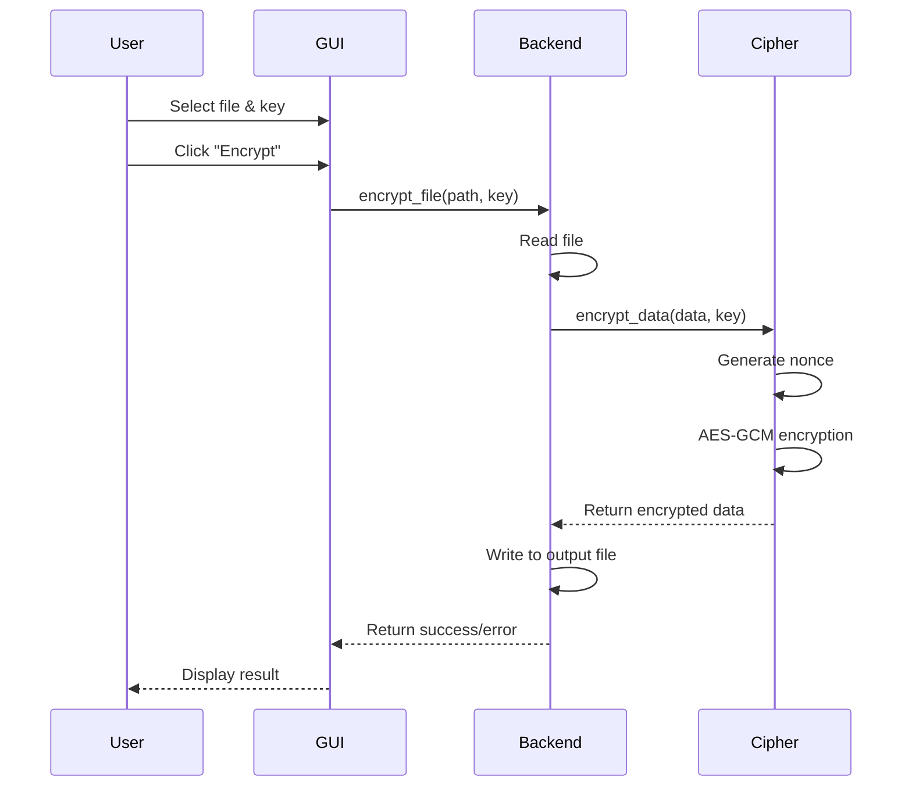
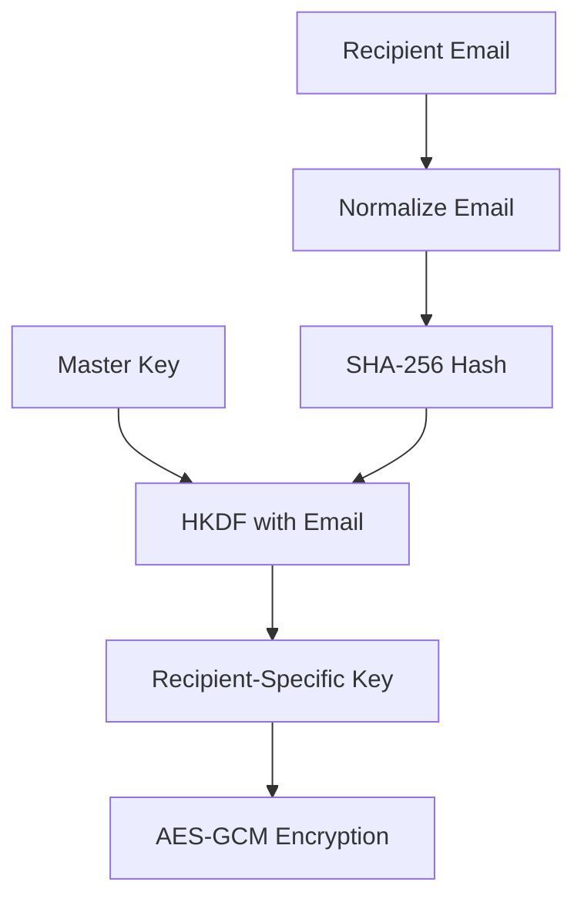
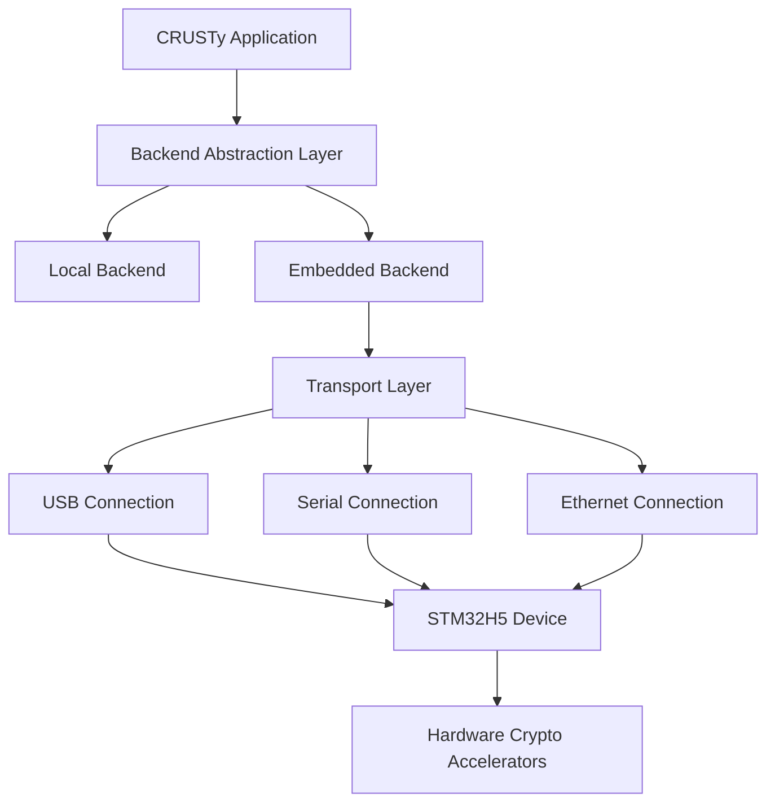
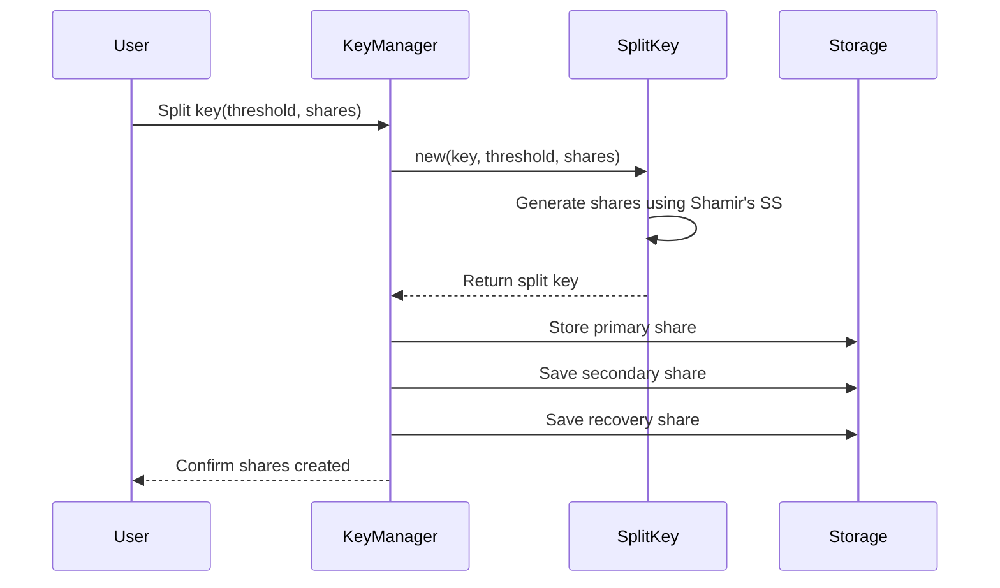
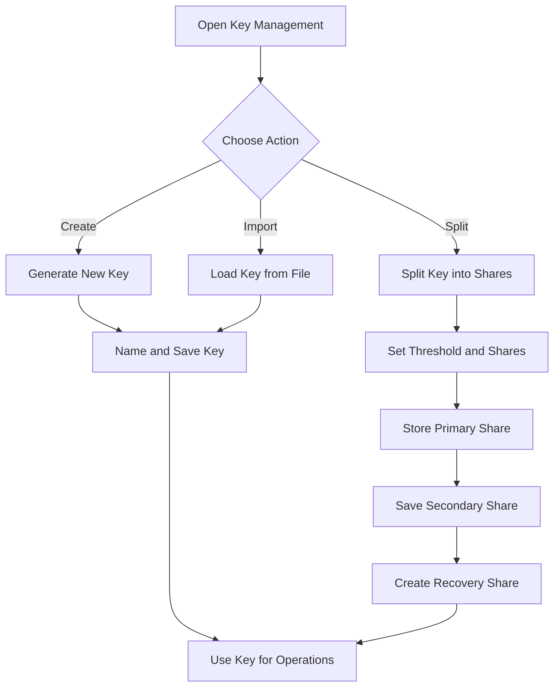
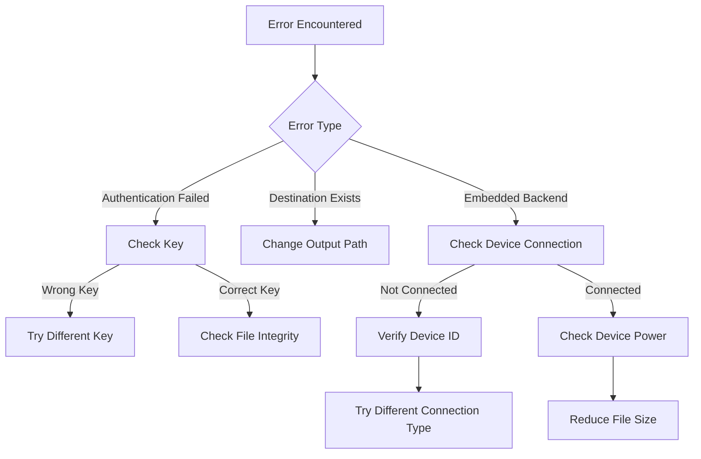

# CRUSTy Training Guide for Security Engineers

**Version: 1.0.0**  
**Last Updated: 2025-03-03**

## Changelog

### v1.0.0 (2025-03-03)

- Initial documented version
- Added comprehensive explanation of encryption functionality
- Added details on recipient-specific encryption
- Added backend abstraction layer documentation
- Added sequence and flow diagrams for key processes

## Introduction

Welcome to CRUSTy, a secure file encryption application built with Rust. This guide provides explanations of CRUSTy's functionality, alternating between technical details and simplified descriptions to help you understand both the implementation details and practical usage.

## Core Functionality

### Key Management

**Technical Implementation**

CRUSTy implements AES-256-GCM encryption using the `aes-gcm` crate, with keys managed through the `EncryptionKey` struct:

```rust
pub struct EncryptionKey {
    key: Key<Aes256Gcm>,  // 256-bit key for AES-GCM
}

impl EncryptionKey {
    pub fn generate() -> Self {
        // Uses the OS-provided CSPRNG for key generation
        let key = Aes256Gcm::generate_key(OsRng);
        EncryptionKey { key }
    }

    pub fn to_base64(&self) -> String {
        // Encodes the binary key as a base64 string for storage
        STANDARD.encode(self.key)
    }

    pub fn from_base64(encoded: &str) -> Result<Self, EncryptionError> {
        // Validates key length and format during import
        let key_bytes = STANDARD.decode(encoded)
            .map_err(|e| EncryptionError::KeyError(format!("Invalid base64 key: {}", e)))?;

        if key_bytes.len() != 32 {
            return Err(EncryptionError::KeyError(
                format!("Invalid key length: {}, expected 32", key_bytes.len())
            ));
        }

        let key = *Key::<Aes256Gcm>::from_slice(&key_bytes);
        Ok(EncryptionKey { key })
    }
}
```

The key management system leverages Rust's type system to ensure keys are handled securely. Keys are generated using the operating system's cryptographically secure random number generator (CSPRNG) and are stored in base64 format for human readability. The implementation includes validation checks to ensure keys are the correct length (32 bytes = 256 bits) and properly formatted.

**Practical Usage**

To manage encryption keys in CRUSTy:

1. **Creating Keys**: Generate a new random 256-bit key by clicking "Create New Key" in the Keys section. Each key is created using your computer's secure random number generator.

2. **Storing Keys**: Keys are stored as base64 text, which converts the binary key data into a readable format. You can save keys to files for backup by clicking "Save Key to File."

3. **Loading Keys**: Import existing keys by clicking "Load Key from File." CRUSTy verifies that the key is valid and the correct length before allowing its use.

4. **Using Keys**: Select the appropriate key from the dropdown menu when encrypting or decrypting files. The selected key must match the one used for encryption to successfully decrypt files.

### Encryption and Decryption

**Technical Implementation**

CRUSTy implements AES-256-GCM authenticated encryption with proper nonce handling:

```rust
pub fn encrypt_data(data: &[u8], key: &EncryptionKey) -> Result<Vec<u8>, EncryptionError> {
    // Initialize the AES-GCM cipher with the provided key
    let cipher = Aes256Gcm::new(&key.key);

    // Generate a unique 12-byte nonce for this encryption operation
    let mut nonce_bytes = [0u8; 12];
    OsRng.fill_bytes(&mut nonce_bytes);
    let nonce = Nonce::from_slice(&nonce_bytes);

    // Perform authenticated encryption
    let encrypted_data = match cipher.encrypt(nonce, data) {
        Ok(data) => data,
        Err(e) => return Err(EncryptionError::Encryption(e.to_string())),
    };

    // Format the output with nonce and encrypted data
    let mut output = Vec::with_capacity(nonce_bytes.len() + 4 + encrypted_data.len());
    output.extend_from_slice(&nonce_bytes);
    output.extend_from_slice(&(encrypted_data.len() as u32).to_le_bytes());
    output.extend_from_slice(&encrypted_data);

    Ok(output)
}
```

The decryption function performs the inverse operation:

```rust
pub fn decrypt_data(data: &[u8], key: &EncryptionKey) -> Result<Vec<u8>, EncryptionError> {
    // Validate input data length
    if data.len() < 12 + 4 {
        return Err(EncryptionError::Decryption("Data too short".to_string()));
    }

    // Extract the nonce from the beginning of the data
    let nonce_bytes = &data[0..12];
    let nonce = Nonce::from_slice(nonce_bytes);

    // Extract the encrypted data length
    let size_bytes = &data[12..16];
    let chunk_size = u32::from_le_bytes([size_bytes[0], size_bytes[1], size_bytes[2], size_bytes[3]]) as usize;

    // Validate encrypted data length
    if data.len() < 16 + chunk_size {
        return Err(EncryptionError::Decryption("Data too short".to_string()));
    }

    // Extract the encrypted data
    let encrypted_chunk = &data[16..16 + chunk_size];

    // Initialize the AES-GCM cipher with the provided key
    let cipher = Aes256Gcm::new(&key.key);

    // Perform authenticated decryption
    let decrypted_data = match cipher.decrypt(nonce, encrypted_chunk) {
        Ok(data) => data,
        Err(e) => {
            // Provide specific error for authentication failures
            if e.to_string().contains("authentication") || e.to_string().contains("tag mismatch") {
                return Err(EncryptionError::Decryption(
                    "Authentication failed: The encryption key is incorrect or the data is corrupted".to_string()
                ));
            } else {
                return Err(EncryptionError::Decryption(e.to_string()));
            }
        }
    };

    Ok(decrypted_data)
}
```

The implementation uses AES-256-GCM, which provides both confidentiality and authentication. Each encryption operation uses a unique nonce (number used once) generated with a cryptographically secure random number generator. The encrypted output includes the nonce, the length of the encrypted data, and the encrypted data itself with its authentication tag. During decryption, the authentication tag is verified to ensure the data hasn't been tampered with.

**Encryption/Decryption Process**



**Practical Usage**

To encrypt and decrypt files with CRUSTy:

1. **Encryption Process**:

   - Select a file to encrypt and choose an output location
   - Select or create an encryption key
   - Click "Encrypt" to secure your file
   - CRUSTy adds a unique random value (nonce) to ensure that even identical files encrypt differently each time
   - The encrypted file includes a tamper-evident seal (authentication tag)

2. **Decryption Process**:
   - Select an encrypted file and choose where to save the decrypted result
   - Select the same key that was used for encryption
   - Click "Decrypt" to recover your original file
   - CRUSTy verifies the authentication tag to ensure the file hasn't been modified
   - If the wrong key is used or the file has been tampered with, you'll receive an error message

### Recipient-Specific Encryption

**Technical Implementation**

CRUSTy implements recipient-specific encryption using key derivation from email addresses:

```rust
fn derive_from_email(email: &str, salt: &[u8]) -> Vec<u8> {
    // Normalize the email by trimming whitespace and converting to lowercase
    let normalized_email = email.trim().to_lowercase();
    let parts: Vec<&str> = normalized_email.split('@').collect();
    let username = parts[0];
    let domain = if parts.len() > 1 { parts[1] } else { "" };

    // Create a SHA-256 hash of the normalized email parts with a salt
    let mut hasher = Sha256::new();
    hasher.update(username.as_bytes());
    hasher.update(b":");
    hasher.update(domain.as_bytes());
    hasher.update(b":");
    hasher.update(salt);

    hasher.finalize().to_vec()
}

impl EncryptionKey {
    pub fn for_recipient(&self, email: &str) -> Result<Self, EncryptionError> {
        // Use a fixed application salt for consistency
        let app_salt = b"CRUSTy-Email-Key-Derivation-Salt-v1";
        let email_material = derive_from_email(email, app_salt);

        // Use HKDF (HMAC-based Key Derivation Function) to derive a new key
        let hkdf = Hkdf::<Sha256>::new(
            Some(&email_material),
            self.key.as_slice()
        );

        // Expand the derived key material to the required length (32 bytes)
        let mut okm = [0u8; 32];
        hkdf.expand(b"encryption", &mut okm)
            .map_err(|_| EncryptionError::KeyError("Key derivation failed".to_string()))?;

        // Create a new encryption key from the derived material
        let derived_key = Key::<Aes256Gcm>::from_slice(&okm);
        Ok(EncryptionKey { key: *derived_key })
    }
}
```

The recipient-specific encryption function:

```rust
pub fn encrypt_data_for_recipient(
    data: &[u8],
    master_key: &EncryptionKey,
    recipient_email: &str
) -> Result<Vec<u8>, EncryptionError> {
    // Derive recipient-specific key
    let recipient_key = master_key.for_recipient(recipient_email)?;

    // Create the cipher instance with the derived key
    let cipher = Aes256Gcm::new(&recipient_key.key);

    // Generate a random nonce
    let mut nonce_bytes = [0u8; 12];
    OsRng.fill_bytes(&mut nonce_bytes);
    let nonce = Nonce::from_slice(&nonce_bytes);

    // Encrypt the data
    let encrypted_data = match cipher.encrypt(nonce, data) {
        Ok(data) => data,
        Err(e) => return Err(EncryptionError::Encryption(e.to_string())),
    };

    // Format the output with nonce, recipient email, and encrypted data
    let email_bytes = recipient_email.as_bytes();
    let mut output = Vec::with_capacity(
        nonce_bytes.len() + 2 + email_bytes.len() + 4 + encrypted_data.len()
    );

    output.extend_from_slice(&nonce_bytes);
    output.extend_from_slice(&(email_bytes.len() as u16).to_le_bytes());
    output.extend_from_slice(email_bytes);
    output.extend_from_slice(&(encrypted_data.len() as u32).to_le_bytes());
    output.extend_from_slice(&encrypted_data);

    Ok(output)
}
```

The recipient-specific encryption uses HKDF (HMAC-based Key Derivation Function) with SHA-256 to derive a unique encryption key from the master key and the recipient's normalized email address. The email is normalized by trimming whitespace and converting to lowercase to ensure consistent key derivation. The encrypted output includes the nonce, the recipient's email address, and the encrypted data with its authentication tag.

**Key Derivation Flow**



**Practical Usage**

To use recipient-specific encryption in CRUSTy:

1. **Setting Up Recipient Encryption**:

   - Check "Use recipient-specific encryption" in the main interface
   - Enter the recipient's email address
   - Select or create a master key
   - Encrypt your file as normal

2. **How It Works**:

   - CRUSTy creates a unique key specifically for that recipient by combining your master key with their email address
   - The recipient's email is stored within the encrypted file
   - The file can only be decrypted with both your master key and knowledge of the recipient's email

3. **Decrypting Recipient-Specific Files**:
   - When decrypting, CRUSTy automatically detects if a file was encrypted for a specific recipient
   - It recreates the recipient-specific key using your master key and the stored email
   - After successful decryption, CRUSTy displays the recipient's email address

This feature is useful for tracking who files were encrypted for and adding an additional layer of security by binding the encrypted data to both your master key and the recipient's identity.

### Backend Abstraction and Embedded System Integration

**Technical Implementation**

CRUSTy implements a backend abstraction layer to support both local (software-based) encryption and hardware-accelerated encryption via embedded devices:

```rust
pub trait EncryptionBackend {
    fn encrypt_data(&self, data: &[u8], key: &EncryptionKey) -> Result<Vec<u8>, EncryptionError>;
    fn decrypt_data(&self, data: &[u8], key: &EncryptionKey) -> Result<Vec<u8>, EncryptionError>;
    fn encrypt_data_for_recipient(
        &self,
        data: &[u8],
        master_key: &EncryptionKey,
        recipient_email: &str
    ) -> Result<Vec<u8>, EncryptionError>;
    // Additional methods for file operations...
}

pub struct LocalBackend;

pub struct EmbeddedConfig {
    pub connection_type: ConnectionType,
    pub device_id: String,
    pub parameters: std::collections::HashMap<String, String>,
}

pub enum ConnectionType {
    Usb,
    Serial,
    Ethernet,
}

pub struct EmbeddedBackend {
    config: EmbeddedConfig,
    connected: bool,
}

pub struct BackendFactory;

impl BackendFactory {
    pub fn create_local() -> Box<dyn EncryptionBackend> {
        Box::new(LocalBackend)
    }

    pub fn create_embedded(config: EmbeddedConfig) -> Box<dyn EncryptionBackend> {
        Box::new(EmbeddedBackend {
            config,
            connected: false,
        })
    }
}
```

The backend selection is handled in the operation coordinator:

```rust
// Create the appropriate backend
let backend = if self.use_embedded_backend && self.embedded_config.is_some() {
    // Use embedded backend if configured
    BackendFactory::create_embedded(self.embedded_config.clone().unwrap())
} else {
    // Use local backend by default
    BackendFactory::create_local()
};
```

The backend abstraction uses Rust's trait system to define a common interface for all encryption backends. This allows the application to seamlessly switch between local (software-based) encryption and hardware-accelerated encryption via embedded devices. The `BackendFactory` provides a factory pattern for creating the appropriate backend based on the user's configuration.

**Embedded System Architecture**



**Practical Usage**

CRUSTy's backend system allows you to choose between software-based encryption and hardware-accelerated encryption:

1. **Local Backend (Default)**:

   - Uses your computer's processor to perform encryption operations
   - Available on all systems without additional hardware
   - Provides strong security through software implementation

2. **Embedded Backend (Optional)**:

   - Connects to an external STM32H5 hardware device
   - Offloads encryption operations to dedicated hardware
   - Provides enhanced security through physical isolation
   - Potentially faster for large files due to hardware acceleration

3. **Configuring the Embedded Backend**:

   - Check "Use embedded system for cryptographic operations"
   - Select the connection type (USB, Serial, or Ethernet)
   - Enter the device identifier or address
     i - Configure any additional connection parameters
   - Click "Apply Configuration"

4. **Automatic Fallback**:
   - If the embedded device is unavailable or encounters an error, CRUSTy automatically falls back to the local backend
   - This ensures operations can continue even if hardware is disconnected

The backend system provides flexibility to choose the appropriate encryption method based on your security requirements and available hardware.

## Practical Usage

### Encrypting Files

**Technical Implementation**

The file encryption process is implemented in the operation coordinator:

```rust
match operation {
    FileOperation::Encrypt => {
        if let Some(file_path) = files.first() {
            let file_path = file_path.clone();
            let file_name = file_path.file_name()
                .unwrap_or_default()
                .to_string_lossy();

            let mut output_path = output_dir.clone();
            output_path.push(format!("{}.encrypted", file_name));

            let progress_clone = progress.clone();

            let result = if use_recipient && !recipient_email.trim().is_empty() {
                // Use recipient-based encryption
                backend.encrypt_file_for_recipient(
                    &file_path,
                    &output_path,
                    &key,
                    &recipient_email,
                    move |p| {
                        let mut guard = progress_clone.lock().unwrap();
                        if !guard.is_empty() {
                            guard[0] = p;
                        }
                    }
                )
            } else {
                // Use standard encryption
                backend.encrypt_file(
                    &file_path,
                    &output_path,
                    &key,
                    move |p| {
                        let mut guard = progress_clone.lock().unwrap();
                        if !guard.is_empty() {
                            guard[0] = p;
                        }
                    }
                )
            };
            // Handle result...
        }
    },
    // Other operations...
}
```

The implementation handles both standard and recipient-specific encryption, with progress tracking through a callback function. It determines the output path based on the input file name and selects the appropriate encryption method based on user settings.

**Practical Usage**

To encrypt a file with CRUSTy:

1. **Select Operation Mode**:

   - Choose "Single File" for individual files or "Multiple Files" for batch processing

2. **Select Files**:

   - Click "Select File(s)" and choose the file(s) you want to encrypt

3. **Configure Output**:

   - Select an output directory where encrypted files will be saved
   - Encrypted files will have the same name as the original with ".encrypted" added

4. **Select Encryption Key**:

   - Choose an existing key or create a new one
   - The key will be used to encrypt all selected files

5. **Optional: Specify Recipient**:

   - Check "Use recipient-specific encryption" if encrypting for a specific person
   - Enter the recipient's email address

6. **Optional: Use Hardware**:

   - Check "Use embedded system" if you have a compatible STM32H5 device
   - Configure the connection settings

7. **Start Encryption**:
   - Click "Encrypt" to begin the process
   - The progress bar will show the current status
   - Results will be displayed when complete

### Decrypting Files

**Technical Implementation**

The file decryption process is implemented in the operation coordinator:

```rust
FileOperation::Decrypt => {
    if let Some(file_path) = files.first() {
        let file_name = file_path.file_name()
            .unwrap_or_default()
            .to_string_lossy();

        let file_stem = file_name.to_string();
        let output_name = if file_stem.ends_with(".encrypted") {
            file_stem.trim_end_matches(".encrypted").to_string()
        } else {
            format!("{}.decrypted", file_stem)
        };

        let mut output_path = output_dir.clone();
        output_path.push(output_name);

        let progress_clone = progress.clone();

        // Try recipient-based decryption first, fall back to standard decryption if it fails
        let result = if use_recipient {
            match backend.decrypt_file_with_recipient(
                file_path,
                &output_path,
                &key,
                move |p| {
                    let mut guard = progress_clone.lock().unwrap();
                    if !guard.is_empty() {
                        guard[0] = p;
                    }
                }
            ) {
                Ok((email, _)) => {
                    // Store the detected recipient email
                    if let Ok(mut results) = shared_results.lock() {
                        results.push(format!("Detected recipient: {}", email));
                    }
                    Ok(())
                },
                Err(e) => {
                    // Fall back to standard decryption
                    backend.decrypt_file(
                        file_path,
                        &output_path,
                        &key,
                        move |p| {
                            let mut guard = progress_clone.lock().unwrap();
                            if !guard.is_empty() {
                                guard[0] = p;
                            }
                        }
                    )
                }
            }
        } else {
            // Use standard decryption
            backend.decrypt_file(
                file_path,
                &output_path,
                &key,
                move |p| {
                    let mut guard = progress_clone.lock().unwrap();
                    if !guard.is_empty() {
                        guard[0] = p;
                    }
                }
            )
        };
        // Handle result...
    }
},
```

The implementation attempts recipient-specific decryption first if enabled, falling back to standard decryption if that fails. It determines the output path based on the input file name, removing the ".encrypted" extension if present. Progress is tracked through a callback function, and any detected recipient information is stored in the results.

**Practical Usage**

To decrypt a file with CRUSTy:

1. **Select Operation Mode**:

   - Choose "Single File" for individual files or "Multiple Files" for batch processing

2. **Select Files**:

   - Click "Select File(s)" and choose the encrypted file(s)

3. **Configure Output**:

   - Select an output directory where decrypted files will be saved
   - Decrypted files will have the ".encrypted" extension removed

4. **Select Decryption Key**:

   - Choose the same key that was used to encrypt the file
   - Using the wrong key will result in an authentication error

5. **Optional: Enable Recipient Detection**:

   - Check "Use recipient-specific encryption" to detect if the file was encrypted for a specific recipient
   - If detected, the recipient's email will be displayed in the results

6. **Optional: Use Hardware**:

   - Check "Use embedded system" if you have a compatible STM32H5 device
   - Configure the connection settings

7. **Start Decryption**:
   - Click "Decrypt" to begin the process
   - The progress bar will show the current status
   - Results will be displayed when complete

If decryption fails with an "Authentication failed" error, it means either:

- You're using the wrong key
- The file has been tampered with
- The file is corrupted

### Batch Processing

**Technical Implementation**

CRUSTy supports batch processing of multiple files:

```rust
FileOperation::BatchEncrypt => {
    let progress_clone = progress.clone();

    // Convert Vec<PathBuf> to Vec<&Path>
    let path_refs: Vec<&Path> = files.iter().map(|p| p.as_path()).collect();

    let results = if use_recipient && !recipient_email.trim().is_empty() {
        // Use recipient-based batch encryption
        backend.encrypt_files_for_recipient(
            &path_refs,
            &output_dir,
            &key,
            &recipient_email,
            move |idx, p| {
                let mut guard = progress_clone.lock().unwrap();
                if idx < guard.len() {
                    guard[idx] = p;
                }
            }
        )
    } else {
        // Use standard batch encryption
        backend.encrypt_files(
            &path_refs,
            &output_dir,
            &key,
            move |idx, p| {
                let mut guard = progress_clone.lock().unwrap();
                if idx < guard.len() {
                    guard[idx] = p;
                }
            }
        )
    };
    // Handle results...
}
```

The batch processing implementation handles multiple files in a single operation, with progress tracking for each file. It selects between standard and recipient-specific encryption based on user settings and processes each file individually, collecting the results.

**Practical Usage**

**User Workflow**

```mermaid
flowchart TD
    A[Start CRUSTy] --> B{Choose Operation}
    B -->|Encrypt| C[Select File(s)]
    B -->|Decrypt| D[Select Encrypted File(s)]
    C --> E[Select Output Directory]
    D --> F[Select Output Directory]
    E --> G[Select/Create Key]
    F --> H[Select Key]
    G --> I{Recipient-Specific?}
    I -->|Yes| J[Enter Email]
    I -->|No| K[Standard Encryption]
    J --> L[Click Encrypt]
    K --> L
    H --> M[Click Decrypt]
    L --> N[View Results]
    M --> N
```

To process multiple files at once with CRUSTy:

1. **Select "Multiple Files" Mode**:

   - Switch to the batch processing mode using the radio button

2. **Select Files**:

   - Click "Select Files" to choose multiple files for processing
   - You can select files of different types and sizes

3. **Configure Output**:

   - Select an output directory where processed files will be saved
   - Each file will be processed individually with its own progress tracking

4. **Select Encryption Key**:

   - Choose an existing key or create a new one
   - The same key will be used for all selected files

5. **Optional: Specify Recipient**:

   - For encryption, you can check "Use recipient-specific encryption" and enter an email
   - All files will be encrypted for the same recipient

6. **Start Processing**:
   - Click "Encrypt" or "Decrypt" to begin the batch operation
   - The progress bar will show the progress for each file
   - Results for each file will be displayed when complete

Batch processing is particularly useful when you need to encrypt or decrypt many files at once, saving time and effort compared to processing files individually.

## Split Key Functionality

CRUSTy implements Shamir's Secret Sharing for splitting encryption keys into multiple shares, enhancing security through multi-party authorization.

**Split Key Sequence**



**Key Management Workflow**



### Technical Implementation

The split key functionality is implemented through the `SplitEncryptionKey` struct and related components:

```rust
pub struct SplitEncryptionKey {
    threshold: u8,
    shares_count: u8,
    shares: Vec<Share>,
    key: Option<EncryptionKey>,
    purpose: KeyPurpose,
}

impl SplitEncryptionKey {
    pub fn new(key: &EncryptionKey, threshold: u8, shares_count: u8, purpose: KeyPurpose) -> Result<Self, SplitKeyError> {
        // Validate threshold and shares count
        if threshold < 2 {
            return Err(SplitKeyError::Sharing("Threshold must be at least 2".to_string()));
        }

        if shares_count < threshold {
            return Err(SplitKeyError::Sharing("Shares count must be at least equal to threshold".to_string()));
        }

        // Get the key as bytes
        let key_bytes = key.to_base64().into_bytes();

        // Create the Shamir's Secret Sharing scheme
        let sharks = Sharks(threshold);

        // Split the key into shares
        let dealer = sharks.dealer(&key_bytes);
        let shares: Vec<Share> = dealer.take(shares_count as usize).collect();

        Ok(SplitEncryptionKey {
            threshold,
            shares_count,
            shares,
            key: Some(key.clone()),
            purpose,
        })
    }

    // Additional methods for share management...
}
```

### Practical Usage

To use the split key functionality in CRUSTy:

1. **Creating Split Keys**:

   - Navigate to the key management section
   - Select a key to split
   - Choose the threshold (minimum shares needed for reconstruction)
   - Choose the total number of shares to create
   - Click "Split Key"

2. **Storing Shares**:

   - The primary share is automatically stored in your system's secure credential store
   - Save the secondary share to a file on a different device or storage medium
   - Create a recovery share as a mnemonic phrase or QR code for emergency backup

3. **Reconstructing Keys**:
   - To reconstruct a key, you need at least the threshold number of shares
   - The primary share is retrieved from the credential store
   - Load the secondary share from its file
   - If needed, input the recovery share from the mnemonic phrase or QR code
   - The key is reconstructed only if the correct shares are provided

This approach enhances security by ensuring that no single point of compromise can expose the encryption key.

## Security Considerations

**Technical Security Details**

CRUSTy implements several security best practices:

1. **AES-256-GCM**: Uses the AES algorithm in Galois/Counter Mode with 256-bit keys, providing both confidentiality and authentication.

2. **Nonce Management**: Generates a unique 96-bit nonce for each encryption operation using a cryptographically secure random number generator (OsRng).

3. **Authentication**: The GCM mode includes a 128-bit authentication tag that verifies both the integrity of the ciphertext and the authenticity of its origin.

4. **Key Derivation**: Uses HKDF with SHA-256 for secure key derivation in recipient-specific encryption, following NIST recommendations.

5. **Error Handling**: Provides specific error messages for authentication failures while avoiding information leakage that could aid attackers.

6. **Hardware Isolation**: Supports offloading cryptographic operations to isolated hardware for enhanced security against software-based attacks.

7. **Memory Safety**: Built with Rust, which provides memory safety guarantees through its ownership system, preventing buffer overflows and use-after-free vulnerabilities.

8. **Secure Defaults**: Generates cryptographically secure random keys by default and requires explicit user action to use potentially weaker imported keys.

**Security Guidelines for Users**

When using CRUSTy, keep these security considerations in mind:

1. **Key Protection**: Your encryption keys are the most critical security element. Store them securely and maintain backups in a safe location.

2. **Strong Keys**: Always use CRUSTy's built-in key generator rather than creating your own keys, as it uses a secure random number generator.

3. **Authentication Warnings**: Pay attention to authentication failure warnings, which indicate either the wrong key is being used or the file has been tampered with.

4. **System Security**: CRUSTy can't protect against malware on your computer that might capture your keys or access your data before encryption.

5. **Physical Security**: If someone has physical access to your computer while you're using CRUSTy with an unlocked key, they might be able to access your files.

6. **Hardware Benefits**: Using the embedded hardware backend provides additional security by isolating cryptographic operations from your main computer.

7. **Key Rotation**: Consider periodically generating new keys for sensitive data, especially if you suspect a key might have been compromised.

Remember that encryption is just one part of a comprehensive security strategy. Maintain good security practices in all aspects of your digital life, including strong passwords, system updates, and malware protection.

**Troubleshooting Decision Tree**



## Troubleshooting

**Common Issues and Solutions**

### "Destination file already exists"

**Technical Cause**: CRUSTy checks if the destination file exists before starting encryption/decryption operations to prevent accidental overwrites:

```rust
// Check if the destination file already exists
if dest_path.exists() {
    return Err(EncryptionError::Io(
        io::Error::new(io::ErrorKind::AlreadyExists, "Destination file already exists")
    ));
}
```

**Solution**: Delete the existing file or choose a different output directory.

### "Authentication failed" or "Wrong encryption key"

**Technical Cause**: AES-GCM includes an authentication tag that verifies the integrity of the data and the correctness of the key. If authentication fails, it means either the key is incorrect or the data has been tampered with:

```rust
// Decrypt the chunk
let decrypted_data = match cipher.decrypt(nonce, encrypted_chunk) {
    Ok(data) => data,
    Err(e) => {
        // Provide a more specific error message for authentication failures
        if e.to_string().contains("authentication") || e.to_string().contains("tag mismatch") {
            return Err(EncryptionError::Decryption(
                "Authentication failed: The encryption key is incorrect or the data is corrupted".to_string()
            ));
        } else {
            return Err(EncryptionError::Decryption(e.to_string()));
        }
    }
};
```

**Solution**: Try a different key if you have one, or check if the file was transferred correctly. If you've lost all copies of the correct key, the file cannot be recovered.

### "Embedded backend not implemented"

**Technical Cause**: The embedded backend is currently a placeholder that returns an error when used:

```rust
fn encrypt_data(&self, data: &[u8], key: &EncryptionKey) -> Result<Vec<u8>, EncryptionError> {
    // This is a placeholder implementation that will be replaced with actual
    // embedded device encryption logic when the embedded system integration is implemented.
    Err(EncryptionError::Encryption("Embedded backend not implemented".to_string()))
}
```

**Solution**: Make sure you've clicked "Apply Configuration" after entering the device details. Check that your device is properly connected and powered on. This error may also appear if the embedded system integration is not yet fully implemented in your version of CRUSTy.

### "Failed to connect to embedded device"

**Technical Cause**: The connection to the embedded device failed during the initialization phase:

```rust
pub fn connect(&mut self) -> Result<(), EncryptionError> {
    // Attempt to establish connection with the device
    // ...
    if connection_failed {
        return Err(EncryptionError::Encryption("Failed to connect to embedded device".to_string()));
    }
    // ...
}
```

**Solution**:

- Verify that the device ID/address is correct
- Check physical connections (USB cable, network connection, etc.)
- Ensure the device is powered on and running the CRUSTy firmware
- Try a different connection type if available

### "Communication error with embedded device"

**Technical Cause**: The connection was established but was interrupted during an operation:

```rust
// During an encryption/decryption operation
if communication_error {
    return Err(EncryptionError::Encryption("Communication error with embedded device".to_string()));
}
```

**Solution**:

- Check for loose connections
- Ensure the device has stable power
- Try reducing the file size if the operation involves large files
- Restart the device and try again
