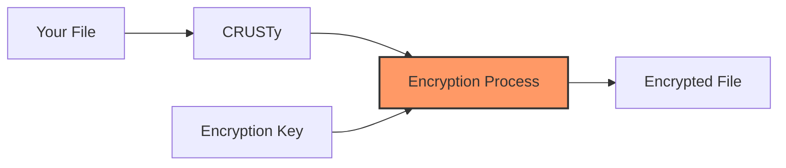
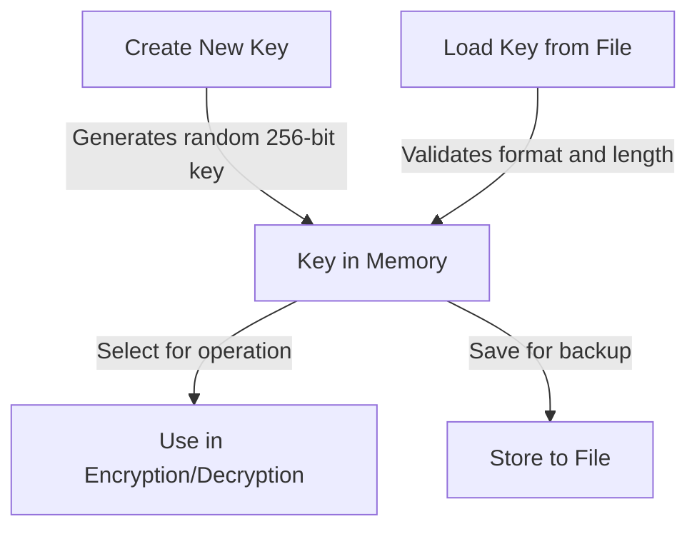
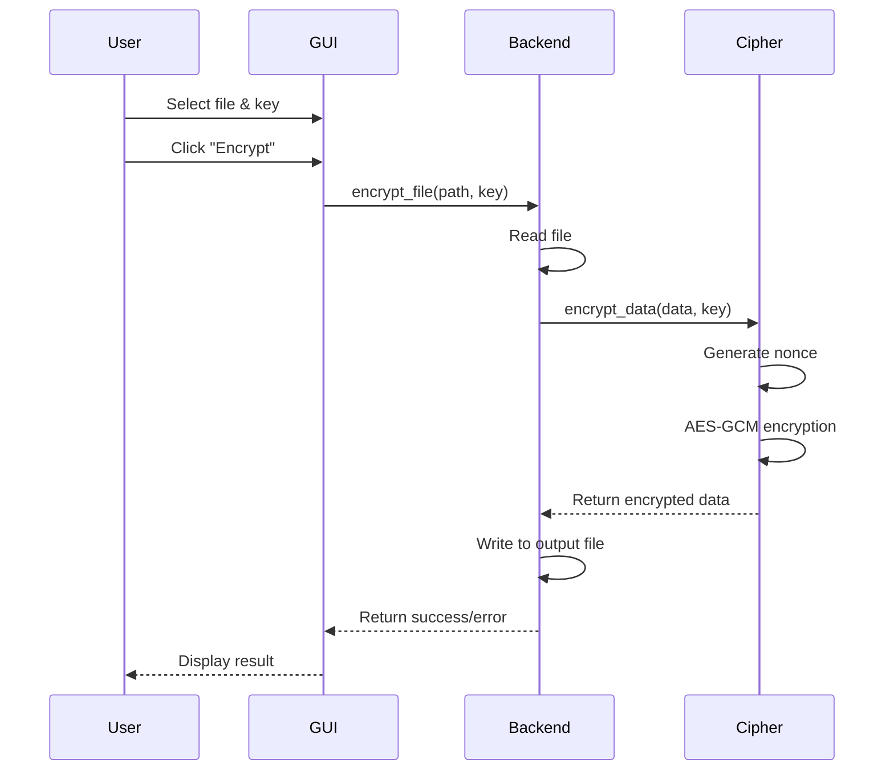
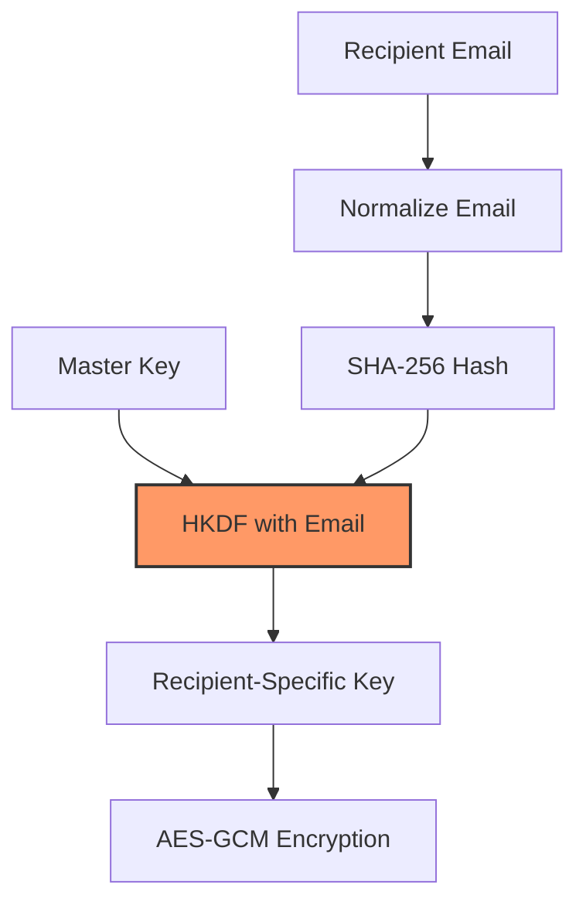
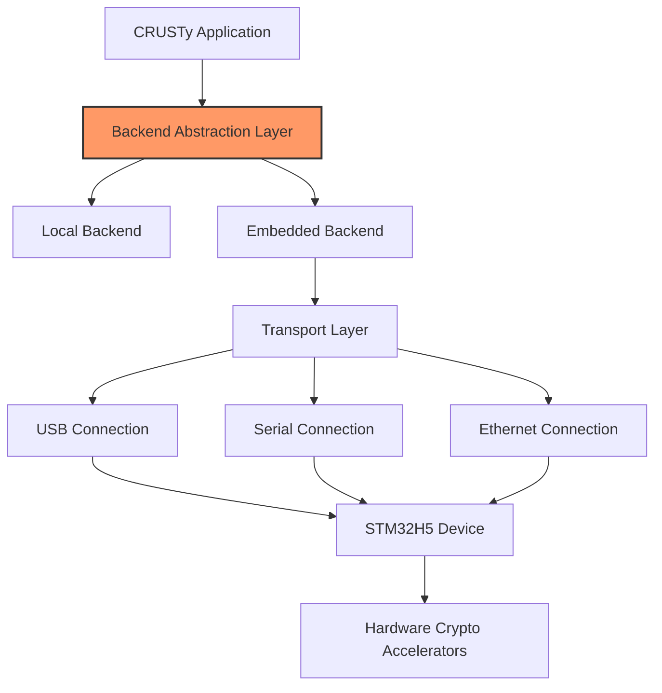
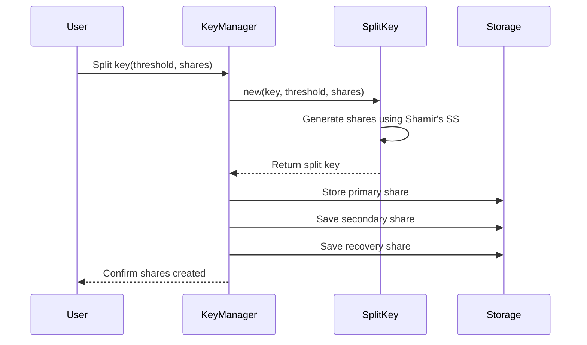
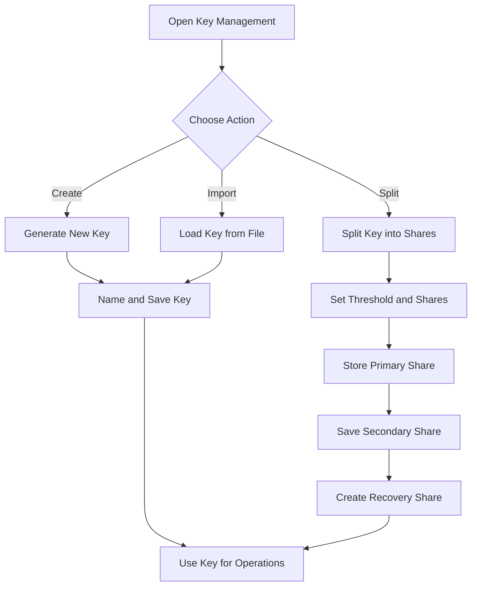
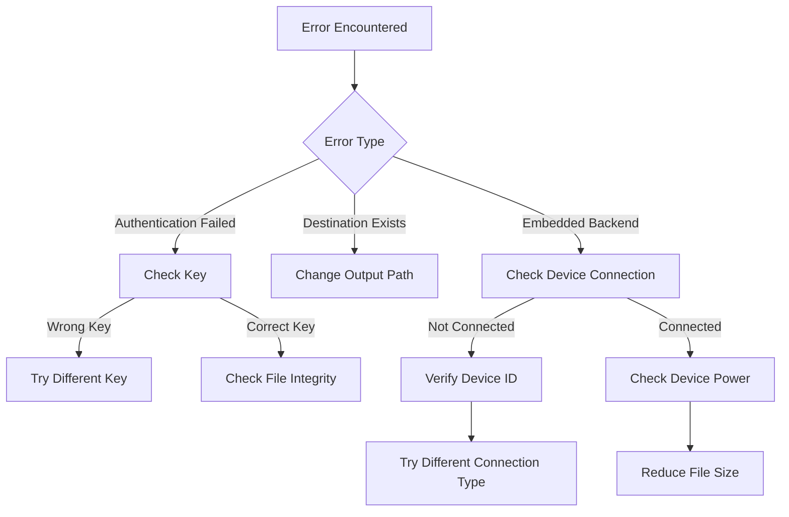

# CRUSTy for Dummies

**Version: 1.0.0**  
**Last Updated: 2025-03-03**

## Introduction

Welcome to CRUSTy, a secure file encryption application built with Rust. This guide will walk you through how CRUSTy works, from its core encryption technology to its practical applications. Whether you're an experienced engineer or new to encryption technology, this guide will help you understand both the "how" and "why" behind CRUSTy's functionality.

## What is CRUSTy?

CRUSTy is a file encryption application that uses industry-standard AES-256-GCM encryption to secure your files. Think of CRUSTy as a digital safe for your files - you lock them up with a special key, and only someone with that same key can unlock them again.



## Core Systems

### Key Management System

At the heart of CRUSTy is its key management system. Encryption keys are like digital master keys that lock and unlock your files.

```rust
pub struct EncryptionKey {
    key: Key<Aes256Gcm>,  // 256-bit key for AES-GCM
    // This stores the actual encryption key material - 32 bytes (256 bits) of data
    // that will be used by the AES-GCM algorithm
}

impl EncryptionKey {
    pub fn generate() -> Self {
        // Uses the OS-provided CSPRNG for key generation
        // We use the operating system's secure random number generator
        // to ensure our keys are truly random and unpredictable
        let key = Aes256Gcm::generate_key(OsRng);
        EncryptionKey { key }
    }

    pub fn to_base64(&self) -> String {
        // Encodes the binary key as a base64 string for storage
        // We convert the binary key to text format so it can be
        // easily stored in files or displayed to users
        STANDARD.encode(self.key)
    }

    pub fn from_base64(encoded: &str) -> Result<Self, EncryptionError> {
        // Validates key length and format during import
        // This ensures that imported keys are valid and the correct length
        let key_bytes = STANDARD.decode(encoded)
            .map_err(|e| EncryptionError::KeyError(format!("Invalid base64 key: {}", e)))?;

        // We verify the key is exactly 32 bytes (256 bits) as required by AES-256
        if key_bytes.len() != 32 {
            return Err(EncryptionError::KeyError(
                format!("Invalid key length: {}, expected 32", key_bytes.len())
            ));
        }

        // Convert the validated bytes back into a proper key
        let key = *Key::<Aes256Gcm>::from_slice(&key_bytes);
        Ok(EncryptionKey { key })
    }
}
```

#### Why Key Management Matters

Think of encryption keys like the keys to your house. If you lose them, you can't get in. If someone else gets a copy, they can enter whenever they want. CRUSTy's key management system is designed to:

1. **Generate Strong Keys**: CRUSTy creates truly random 256-bit keys (that's like a password with 78 random characters!)
2. **Store Keys Securely**: Keys are stored in base64 format, making them easy to back up
3. **Validate Keys**: When importing keys, CRUSTy verifies they're the correct format and length

To manage keys in CRUSTy:
- Create new keys through the "Create New Key" button
- Save keys to files for backup
- Load existing keys from files
- Select the appropriate key when encrypting or decrypting



### Encryption and Decryption Engine

CRUSTy's encryption engine uses AES-256-GCM, which provides both confidentiality (keeping data secret) and authentication (verifying data hasn't been tampered with).

```rust
pub fn encrypt_data(data: &[u8], key: &EncryptionKey) -> Result<Vec<u8>, EncryptionError> {
    // Initialize the AES-GCM cipher with the provided key
    // This prepares the encryption algorithm with our key
    let cipher = Aes256Gcm::new(&key.key);

    // Generate a unique 12-byte nonce for this encryption operation
    // The nonce (number used once) ensures that even if we encrypt the same
    // file twice with the same key, the results will be different
    let mut nonce_bytes = [0u8; 12];
    OsRng.fill_bytes(&mut nonce_bytes);
    let nonce = Nonce::from_slice(&nonce_bytes);

    // Perform authenticated encryption
    // This not only encrypts the data but also creates an authentication tag
    // that will detect if the encrypted data is later modified
    let encrypted_data = match cipher.encrypt(nonce, data) {
        Ok(data) => data,
        Err(e) => return Err(EncryptionError::Encryption(e.to_string())),
    };

    // Format the output with nonce and encrypted data
    // We store the nonce with the encrypted data so it can be used for decryption
    let mut output = Vec::with_capacity(nonce_bytes.len() + 4 + encrypted_data.len());
    output.extend_from_slice(&nonce_bytes);
    output.extend_from_slice(&(encrypted_data.len() as u32).to_le_bytes());
    output.extend_from_slice(&encrypted_data);

    Ok(output)
}
```

#### How Encryption Works

Imagine your data as a letter you want to keep private. The encryption process is like:

1. **Preparing the Lock (Cipher)**: CRUSTy initializes the AES-GCM algorithm with your key
2. **Creating a Unique Seal (Nonce)**: A random 12-byte value ensures each encryption is unique
3. **Sealing the Envelope (Encryption)**: Your data is encrypted and an authentication tag is added
4. **Packaging Everything Together**: The nonce, data length, and encrypted data are combined

The decryption process reverses these steps:

```rust
pub fn decrypt_data(data: &[u8], key: &EncryptionKey) -> Result<Vec<u8>, EncryptionError> {
    // Validate input data length
    // We ensure the encrypted data is at least long enough to contain
    // the nonce (12 bytes) and the data length field (4 bytes)
    if data.len() < 12 + 4 {
        return Err(EncryptionError::Decryption("Data too short".to_string()));
    }

    // Extract the nonce from the beginning of the data
    // We need the same nonce that was used during encryption
    let nonce_bytes = &data[0..12];
    let nonce = Nonce::from_slice(nonce_bytes);

    // Extract the encrypted data length
    // This tells us how many bytes of encrypted data to expect
    let size_bytes = &data[12..16];
    let chunk_size = u32::from_le_bytes([size_bytes[0], size_bytes[1], size_bytes[2], size_bytes[3]]) as usize;

    // Validate encrypted data length
    if data.len() < 16 + chunk_size {
        return Err(EncryptionError::Decryption("Data too short".to_string()));
    }

    // Extract the encrypted data
    let encrypted_chunk = &data[16..16 + chunk_size];

    // Initialize the AES-GCM cipher with the provided key
    let cipher = Aes256Gcm::new(&key.key);

    // Perform authenticated decryption
    // This verifies the authentication tag before decrypting,
    // ensuring the data hasn't been tampered with
    let decrypted_data = match cipher.decrypt(nonce, encrypted_chunk) {
        Ok(data) => data,
        Err(e) => {
            // Provide specific error for authentication failures
            if e.to_string().contains("authentication") || e.to_string().contains("tag mismatch") {
                return Err(EncryptionError::Decryption(
                    "Authentication failed: The encryption key is incorrect or the data is corrupted".to_string()
                ));
            } else {
                return Err(EncryptionError::Decryption(e.to_string()));
            }
        }
    };

    Ok(decrypted_data)
}
```

#### The Encryption/Decryption Flow



### Recipient-Specific Encryption

CRUSTy can create encryption that's tied to a specific recipient's email address, adding an extra layer of security and tracking.

```rust
fn derive_from_email(email: &str, salt: &[u8]) -> Vec<u8> {
    // Normalize the email by trimming whitespace and converting to lowercase
    // This ensures consistent results even if the email is entered differently
    let normalized_email = email.trim().to_lowercase();
    let parts: Vec<&str> = normalized_email.split('@').collect();
    let username = parts[0];
    let domain = if parts.len() > 1 { parts[1] } else { "" };

    // Create a SHA-256 hash of the normalized email parts with a salt
    // This creates a unique but consistent value derived from the email
    // The salt ensures that even if someone knows we're using email hashing,
    // they can't easily predict the output without knowing our salt value
    let mut hasher = Sha256::new();
    hasher.update(username.as_bytes());
    hasher.update(b":");
    hasher.update(domain.as_bytes());
    hasher.update(b":");
    hasher.update(salt);

    hasher.finalize().to_vec()
}

impl EncryptionKey {
    pub fn for_recipient(&self, email: &str) -> Result<Self, EncryptionError> {
        // Use a fixed application salt for consistency
        let app_salt = b"CRUSTy-Email-Key-Derivation-Salt-v1";
        let email_material = derive_from_email(email, app_salt);

        // Use HKDF (HMAC-based Key Derivation Function) to derive a new key
        // This combines our master key with the email-derived material
        // to create a unique key specific to this recipient
        let hkdf = Hkdf::<Sha256>::new(
            Some(&email_material),
            self.key.as_slice()
        );

        // Expand the derived key material to the required length (32 bytes)
        let mut okm = [0u8; 32];
        hkdf.expand(b"encryption", &mut okm)
            .map_err(|_| EncryptionError::KeyError("Key derivation failed".to_string()))?;

        // Create a new encryption key from the derived material
        let derived_key = Key::<Aes256Gcm>::from_slice(&okm);
        Ok(EncryptionKey { key: *derived_key })
    }
}
```

#### Why Use Recipient-Specific Encryption?

Think of recipient-specific encryption like a personalized lock that only works for a specific person. It's useful when:

1. You want to track who files were encrypted for
2. You want to add an extra layer of security by binding the encryption to both your key and the recipient's identity
3. You need to manage encrypted files for multiple recipients



The process works by:
1. Normalizing the email (removing whitespace, converting to lowercase)
2. Creating a unique but consistent value from the email using SHA-256
3. Combining this value with your master key using HKDF
4. Using the resulting key for encryption
5. Storing the recipient's email within the encrypted file

When decrypting, CRUSTy:
1. Extracts the recipient email from the file
2. Recreates the recipient-specific key using your master key and the email
3. Decrypts the file and displays the recipient's email

### Backend Abstraction System

CRUSTy uses a flexible backend system that can switch between software-based encryption and hardware-accelerated encryption via embedded devices.

```rust
pub trait EncryptionBackend {
    // This trait defines the interface that all encryption backends must implement
    // It allows us to swap different implementations without changing the rest of the code
    fn encrypt_data(&self, data: &[u8], key: &EncryptionKey) -> Result<Vec<u8>, EncryptionError>;
    fn decrypt_data(&self, data: &[u8], key: &EncryptionKey) -> Result<Vec<u8>, EncryptionError>;
    fn encrypt_data_for_recipient(
        &self,
        data: &[u8],
        master_key: &EncryptionKey,
        recipient_email: &str
    ) -> Result<Vec<u8>, EncryptionError>;
    // Additional methods for file operations...
}

pub struct LocalBackend;  // Software-based implementation

pub struct EmbeddedConfig {
    // Configuration for connecting to hardware encryption devices
    pub connection_type: ConnectionType,
    pub device_id: String,
    pub parameters: std::collections::HashMap<String, String>,
}

pub enum ConnectionType {
    Usb,
    Serial,
    Ethernet,
}

pub struct EmbeddedBackend {
    config: EmbeddedConfig,
    connected: bool,
}

pub struct BackendFactory;

impl BackendFactory {
    // Factory pattern for creating the appropriate backend
    pub fn create_local() -> Box<dyn EncryptionBackend> {
        Box::new(LocalBackend)
    }

    pub fn create_embedded(config: EmbeddedConfig) -> Box<dyn EncryptionBackend> {
        Box::new(EmbeddedBackend {
            config,
            connected: false,
        })
    }
}
```

#### Why Use a Backend Abstraction?

The backend abstraction is like having both a software calculator and a dedicated hardware calculator. You can use whichever is more appropriate for your needs, and the rest of the application doesn't need to know which one you're using.

Benefits include:
1. **Flexibility**: Switch between software and hardware encryption without changing the rest of the application
2. **Enhanced Security**: Option to use isolated hardware for sensitive operations
3. **Performance**: Potential speed improvements for large files with hardware acceleration
4. **Reliability**: Automatic fallback to software if hardware is unavailable



## Using CRUSTy

### Encrypting Files

The file encryption process in CRUSTy is handled by the operation coordinator:

```rust
match operation {
    FileOperation::Encrypt => {
        if let Some(file_path) = files.first() {
            let file_path = file_path.clone();
            // Extract the file name from the path
            let file_name = file_path.file_name()
                .unwrap_or_default()
                .to_string_lossy();

            // Create the output path by adding .encrypted extension
            let mut output_path = output_dir.clone();
            output_path.push(format!("{}.encrypted", file_name));

            // Clone the progress tracker for the callback
            let progress_clone = progress.clone();

            // Choose between standard and recipient-specific encryption
            let result = if use_recipient && !recipient_email.trim().is_empty() {
                // Use recipient-based encryption when a recipient email is provided
                backend.encrypt_file_for_recipient(
                    &file_path,
                    &output_path,
                    &key,
                    &recipient_email,
                    move |p| {
                        // Update progress bar as encryption proceeds
                        let mut guard = progress_clone.lock().unwrap();
                        if !guard.is_empty() {
                            guard[0] = p;
                        }
                    }
                )
            } else {
                // Use standard encryption otherwise
                backend.encrypt_file(
                    &file_path,
                    &output_path,
                    &key,
                    move |p| {
                        // Update progress bar as encryption proceeds
                        let mut guard = progress_clone.lock().unwrap();
                        if !guard.is_empty() {
                            guard[0] = p;
                        }
                    }
                )
            };
            // Handle result...
        }
    },
    // Other operations...
}
```

#### Encrypting a File: Step by Step

To encrypt a file with CRUSTy:

1. **Select Your File**: Click "Select File(s)" and choose what you want to encrypt
2. **Choose Where to Save**: Select an output directory for the encrypted file
3. **Select Your Key**: Choose an existing key or create a new one
4. **Optional: Specify a Recipient**: If you're encrypting for someone specific, check "Use recipient-specific encryption" and enter their email
5. **Optional: Use Hardware**: If you have a compatible STM32H5 device, you can enable hardware acceleration
6. **Start Encryption**: Click "Encrypt" and watch the progress bar

Behind the scenes, CRUSTy:
1. Reads your file in chunks to handle files of any size
2. Applies AES-256-GCM encryption with your selected key
3. Adds a unique nonce to ensure security
4. Includes an authentication tag to detect tampering
5. Writes the encrypted data to the output file

### Decrypting Files

The decryption process reverses the encryption:

```rust
FileOperation::Decrypt => {
    if let Some(file_path) = files.first() {
        // Extract the file name from the path
        let file_name = file_path.file_name()
            .unwrap_or_default()
            .to_string_lossy();

        // Determine the output name by removing .encrypted extension if present
        let file_stem = file_name.to_string();
        let output_name = if file_stem.ends_with(".encrypted") {
            file_stem.trim_end_matches(".encrypted").to_string()
        } else {
            format!("{}.decrypted", file_stem)
        };

        // Create the output path
        let mut output_path = output_dir.clone();
        output_path.push(output_name);

        // Clone the progress tracker for the callback
        let progress_clone = progress.clone();

        // Try recipient-based decryption first, fall back to standard decryption if it fails
        let result = if use_recipient {
            match backend.decrypt_file_with_recipient(
                file_path,
                &output_path,
                &key,
                move |p| {
                    // Update progress bar as decryption proceeds
                    let mut guard = progress_clone.lock().unwrap();
                    if !guard.is_empty() {
                        guard[0] = p;
                    }
                }
            ) {
                Ok((email, _)) => {
                    // Store the detected recipient email for display
                    if let Ok(mut results) = shared_results.lock() {
                        results.push(format!("Detected recipient: {}", email));
                    }
                    Ok(())
                },
                Err(e) => {
                    // Fall back to standard decryption if recipient-specific fails
                    backend.decrypt_file(
                        file_path,
                        &output_path,
                        &key,
                        move |p| {
                            let mut guard = progress_clone.lock().unwrap();
                            if !guard.is_empty() {
                                guard[0] = p;
                            }
                        }
                    )
                }
            }
        } else {
            // Use standard decryption when recipient detection is disabled
            backend.decrypt_file(
                file_path,
                &output_path,
                &key,
                move |p| {
                    let mut guard = progress_clone.lock().unwrap();
                    if !guard.is_empty() {
                        guard[0] = p;
                    }
                }
            )
        };
        // Handle result...
    }
},
```

#### Decrypting a File: Step by Step

To decrypt a file with CRUSTy:

1. **Select Your Encrypted File**: Click "Select File(s)" and choose the encrypted file
2. **Choose Where to Save**: Select an output directory for the decrypted file
3. **Select Your Key**: Choose the same key that was used for encryption
4. **Optional: Enable Recipient Detection**: Check "Use recipient-specific encryption" to detect if the file was encrypted for a specific recipient
5. **Start Decryption**: Click "Decrypt" and watch the progress bar

Behind the scenes, CRUSTy:
1. Extracts the nonce and encrypted data from the file
2. Verifies the authentication tag to ensure the file hasn't been tampered with
3. Decrypts the data using your key
4. Writes the decrypted data to the output file

If decryption fails with an "Authentication failed" error, it means either:
- You're using the wrong key
- The file has been tampered with
- The file is corrupted

### Batch Processing

CRUSTy can process multiple files at once:

```rust
FileOperation::BatchEncrypt => {
    // Clone the progress tracker for the callback
    let progress_clone = progress.clone();

    // Convert Vec<PathBuf> to Vec<&Path> for the backend API
    let path_refs: Vec<&Path> = files.iter().map(|p| p.as_path()).collect();

    // Choose between standard and recipient-specific batch encryption
    let results = if use_recipient && !recipient_email.trim().is_empty() {
        // Use recipient-based batch encryption
        backend.encrypt_files_for_recipient(
            &path_refs,
            &output_dir,
            &key,
            &recipient_email,
            move |idx, p| {
                // Update progress bar for each file as encryption proceeds
                let mut guard = progress_clone.lock().unwrap();
                if idx < guard.len() {
                    guard[idx] = p;
                }
            }
        )
    } else {
        // Use standard batch encryption
        backend.encrypt_files(
            &path_refs,
            &output_dir,
            &key,
            move |idx, p| {
                // Update progress bar for each file as encryption proceeds
                let mut guard = progress_clone.lock().unwrap();
                if idx < guard.len() {
                    guard[idx] = p;
                }
            }
        )
    };
    // Handle results...
}
```

#### The User Workflow

```mermaid
flowchart TD
    A[Start CRUSTy] --> B{Choose Operation}
    B -->|Encrypt| C[Select File(s)]
    B -->|Decrypt| D[Select Encrypted File(s)]
    C --> E[Select Output Directory]
    D --> F[Select Output Directory]
    E --> G[Select/Create Key]
    F --> H[Select Key]
    G --> I{Recipient-Specific?}
    I -->|Yes| J[Enter Email]
    I -->|No| K[Standard Encryption]
    J --> L[Click Encrypt]
    K --> L
    H --> M[Click Decrypt]
    L --> N[View Results]
    M --> N
```

## Advanced Features

### Split Key System

CRUSTy implements Shamir's Secret Sharing for splitting encryption keys into multiple shares. This is like cutting a key into pieces where you need a certain number of pieces to reconstruct the original key.

```rust
pub struct SplitEncryptionKey {
    threshold: u8,        // Minimum number of shares needed to reconstruct
    shares_count: u8,     // Total number of shares created
    shares: Vec<Share>,   // The actual key shares
    key: Option<EncryptionKey>,  // The original key (if available)
    purpose: KeyPurpose,  // What this split key is used for
}

impl SplitEncryptionKey {
    pub fn new(key: &EncryptionKey, threshold: u8, shares_count: u8, purpose: KeyPurpose) -> Result<Self, SplitKeyError> {
        // Validate threshold and shares count
        // We need at least 2 shares for splitting to be meaningful
        if threshold < 2 {
            return Err(SplitKeyError::Sharing("Threshold must be at least 2".to_string()));
        }

        // We can't require more shares than we create
        if shares_count < threshold {
            return Err(SplitKeyError::Sharing("Shares count must be at least equal to threshold".to_string()));
        }

        // Get the key as bytes for the sharing algorithm
        let key_bytes = key.to_base64().into_bytes();

        // Create the Shamir's Secret Sharing scheme with our threshold
        // This mathematical algorithm splits a secret into parts where
        // you need a minimum number of parts to reconstruct the original
        let sharks = Sharks(threshold);

        // Split the key into the requested number of shares
        let dealer = sharks.dealer(&key_bytes);
        let shares: Vec<Share> = dealer.take(shares_count as usize).collect();

        Ok(SplitEncryptionKey {
            threshold,
            shares_count,
            shares,
            key: Some(key.clone()),
            purpose,
        })
    }

    // Additional methods for share management...
}
```

#### How Split Keys Work



The split key system is like having a safety deposit box that requires multiple keys to open. It's useful for:

1. **Enhanced Security**: No single point of compromise can expose the encryption key
2. **Multi-Party Authorization**: Require multiple people to approve decryption
3. **Disaster Recovery**: Create backup shares that can be stored in different locations

To use split keys:
1. **Create Split Keys**: Select a key, choose a threshold (minimum shares needed) and total shares
2. **Store Shares Securely**: Save different shares in different locations
3. **Reconstruct When Needed**: Provide at least the threshold number of shares to recreate the original key



## Security Considerations

CRUSTy implements several security best practices:

### AES-256-GCM

Think of AES-256-GCM as a high-security lock with a built-in alarm system. The AES-256 part is the lock itself (very difficult to pick), while the GCM part is the alarm that detects if someone tries to tamper with the lock.

Technical benefits:
- 256-bit keys provide protection against brute force attacks
- GCM mode adds authentication to detect tampering
- Industry-standard algorithm with extensive security analysis

### Nonce Management

A nonce is like a unique serial number for each lock. Even if you use the same key to lock multiple items, each lock has a different serial number, making it impossible to copy one lock to another item.

CRUSTy generates a random 12-byte (96-bit) nonce for each encryption operation, ensuring that:
- Encrypting the same file twice produces different results
- Attackers can't use patterns in encrypted data to break the encryption

### Authentication

Authentication in encryption is like a tamper-evident seal. If someone modifies the encrypted data, the seal is broken, and CRUSTy will detect it during decryption.

The GCM mode includes a 128-bit authentication tag that:
- Verifies the integrity of the encrypted data
- Confirms the data was encrypted with the correct key
- Prevents attackers from modifying encrypted data without detection

### Key Derivation

For recipient-specific encryption, CRUSTy uses HKDF (HMAC-based Key Derivation Function) with SHA-256. This is like creating a unique key for each person that's derived from your master key and their identity.

Benefits:
- Creates unique keys for different recipients
- Follows NIST recommendations for secure key derivation
- Ensures consistent key generation when the same email is used

### Memory Safety

CRUSTy is built with Rust, which provides strong memory safety guarantees. This is like having a car with advanced safety features that prevent accidents before they happen.

Rust's safety features prevent common security vulnerabilities:
- Buffer overflows
- Use-after-free errors
- Data races
- Memory leaks

### Security Guidelines

When using CRUSTy, keep these security considerations in mind:

1. **Protect Your Keys**: Your encryption keys are the most critical security element. Store them securely and maintain backups in a safe location.

2. **Use Strong Keys**: Always use CRUSTy's built-in key generator rather than creating your own keys, as it uses a secure random number generator.

3. **Authentication Warnings**: Pay attention to authentication failure warnings, which indicate either the wrong key is being used or the file has been tampered with.

4. **System Security**: CRUSTy can't protect against malware on your computer that might capture your keys or access your data before encryption.

5. **Physical Security**: If someone has physical access to your computer while you're using CRUSTy with an unlocked key, they might be able to access your files.

6. **Hardware Benefits**: Using the embedded hardware backend provides additional security by isolating cryptographic operations from your main computer.

7. **Key Rotation**: Consider periodically generating new keys for sensitive data, especially if you suspect a key might have been compromised.

Remember that encryption is just one part of a comprehensive security strategy. Maintain good security practices in all aspects of your digital life, including strong passwords, system updates, and malware protection.

### Troubleshooting Decision Tree



## Troubleshooting Common Issues

### "Destination file already exists"

This error occurs when CRUSTy tries to save an encrypted or decrypted file to a location where a file with the same name already exists.

```rust
// Check if the destination file already exists
if dest_path.exists() {
    return Err(EncryptionError::Io(
        io::Error::new(io::ErrorKind::AlreadyExists, "Destination file already exists")
    ));
}
```

Why this happens: CRUSTy prevents accidental overwrites of existing files to avoid data loss. This is like having a safety mechanism that prevents you from accidentally saving over important documents.

Solution: Either delete the existing file or choose a different output directory.

### "Authentication failed" or "Wrong encryption key"

This error occurs when the authentication tag verification fails during decryption.

```rust
// Decrypt the chunk
let decrypted_data = match cipher.decrypt(nonce, encrypted_chunk) {
    Ok(data) => data,
    Err(e) => {
        // Provide a more specific error message for authentication failures
        if e.to_string().contains("authentication") || e.to_string().contains("tag mismatch") {
            return Err(EncryptionError::Decryption(
                "Authentication failed: The encryption key is incorrect or the data is corrupted".to_string()
            ));
        } else {
            return Err(EncryptionError::Decryption(e.to_string()));
        }
    }
};
```

Why this happens: AES-GCM includes an authentication tag that verifies both the integrity of the data and the correctness of the key. This is like a tamper-evident seal that breaks if someone tries to modify the encrypted data or if the wrong key is used.

Solution: Try a different key if you have one, or check if the file was transferred correctly. If you've lost all copies of the correct key, the file cannot be recovered.

### "Embedded backend not implemented" or "Failed to connect to embedded device"

These errors occur when there are issues with the embedded hardware backend.

```rust
fn encrypt_data(&self, data: &[u8], key: &EncryptionKey) -> Result<Vec<u8>, EncryptionError> {
    // This is a placeholder implementation that will be replaced with actual
    // embedded device encryption logic when the embedded system integration is implemented.
    Err(EncryptionError::Encryption("Embedded backend not implemented".to_string()))
}
```

Why this happens: The embedded backend requires proper configuration and a connected STM32H5 device. This is like trying to use a specialized calculator that isn't plugged in or isn't properly set up.

Solution:
- Make sure you've clicked "Apply Configuration" after entering the device details
- Check that your device is properly connected and powered on
- Verify that the device ID/address is correct
- Try a different connection type if available
- If all else fails, switch to the local backend

## Conclusion

CRUSTy provides a powerful, flexible, and secure way to protect your sensitive files. By understanding how the system works and following best practices, you can ensure your data remains private and secure.

Whether you're an experienced security engineer or new to encryption, CRUSTy's combination of strong encryption algorithms, intuitive interface, and advanced features makes it a valuable tool for protecting your digital information.

Remember that the best security comes from understanding both the technical aspects of how encryption works and the practical considerations of how to use it effectively in your daily workflow.
