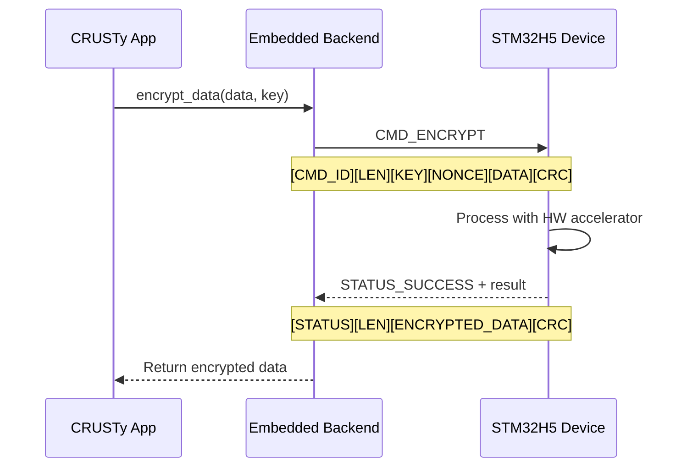

# CRUSTy Embedded Systems Integration

**Version: 0.5.0**  
**Last Updated: 2025-03-03**

## Changelog

### v0.5.0 (2025-03-03)

- Initial documentation of embedded systems architecture
- Defined communication protocol and command set
- Added implementation roadmap
- Added sequence and architecture diagrams
- Documented placeholder status of current implementation

This document provides technical details on the embedded systems integration for CRUSTy, focusing on the STM32H5 series microcontrollers with hardware cryptographic acceleration.

## Current Implementation Status

The embedded backend is currently implemented as a placeholder in the CRUSTy codebase. The interface and architecture are defined, but the actual communication with embedded devices is not yet implemented. This document outlines the planned implementation and provides guidance for developers working on this integration.

## Architecture Overview

The embedded systems integration follows a layered architecture:

```
┌─────────────────────────────────────────────────────┐
│                  CRUSTy Application                  │
└───────────────────────────┬─────────────────────────┘
                            │
┌───────────────────────────▼─────────────────────────┐
│               Backend Abstraction Layer              │
│  (Trait-based interface for encryption backends)     │
└───────────────────────────┬─────────────────────────┘
                            │
┌───────────────────────────▼─────────────────────────┐
│               Embedded Backend                       │
│  (Communication with embedded device)                │
└───────────────────────────┬─────────────────────────┘
                            │
┌───────────────────────────▼─────────────────────────┐
│               Transport Layer                        │
│  (USB, Serial, or Ethernet communication)            │
└───────────────────────────┬─────────────────────────┘
                            │
┌───────────────────────────▼─────────────────────────┐
│               STM32H5 Device                         │
│  (Hardware-accelerated cryptographic operations)     │
└─────────────────────────────────────────────────────┘
```

## Backend Abstraction Layer

The backend abstraction layer defines a common interface for all encryption backends through the `EncryptionBackend` trait:

```rust
pub trait EncryptionBackend {
    fn encrypt_data(&self, data: &[u8], key: &EncryptionKey) -> Result<Vec<u8>, EncryptionError>;
    fn decrypt_data(&self, data: &[u8], key: &EncryptionKey) -> Result<Vec<u8>, EncryptionError>;
    fn encrypt_data_for_recipient(&self, data: &[u8], master_key: &EncryptionKey, recipient_email: &str) -> Result<Vec<u8>, EncryptionError>;
    fn decrypt_data_with_recipient(&self, data: &[u8], master_key: &EncryptionKey) -> Result<(String, Vec<u8>), EncryptionError>;
    // Additional methods for file operations...
}
```

This trait ensures that all backends provide the same functionality, allowing the application to seamlessly switch between local and embedded processing.

## Embedded Backend

The embedded backend is responsible for communicating with the STM32H5 device and translating between the `EncryptionBackend` trait methods and the device's protocol.

### Configuration

The embedded backend is configured using the `EmbeddedConfig` struct:

```rust
pub struct EmbeddedConfig {
    pub connection_type: ConnectionType,
    pub device_id: String,
    pub parameters: std::collections::HashMap<String, String>,
}

pub enum ConnectionType {
    Usb,
    Serial,
    Ethernet,
}
```

This configuration specifies:

- The type of connection (USB, Serial, or Ethernet)
- The device identifier or address
- Additional connection parameters (e.g., baud rate, timeout, etc.)

### Connection Management

The embedded backend includes methods for managing the connection to the device:

```rust
impl EmbeddedBackend {
    pub fn connect(&mut self) -> Result<(), EncryptionError>;
    pub fn is_connected(&self) -> bool;
    pub fn disconnect(&mut self);
}
```

## Communication Protocol

The communication between the CRUSTy application and the STM32H5 device follows a custom binary protocol:

### Command Protocol Sequence



### Command Format

```
[COMMAND_ID][PAYLOAD_LENGTH][PAYLOAD][CHECKSUM]
```

- `COMMAND_ID`: 1 byte identifying the command
- `PAYLOAD_LENGTH`: 4 bytes (little-endian) specifying the length of the payload
- `PAYLOAD`: Variable-length data specific to the command
- `CHECKSUM`: 2 bytes (CRC16) for error detection

### Response Format

```
[STATUS_CODE][PAYLOAD_LENGTH][PAYLOAD][CHECKSUM]
```

- `STATUS_CODE`: 1 byte indicating success (0x00) or an error code
- `PAYLOAD_LENGTH`: 4 bytes (little-endian) specifying the length of the payload
- `PAYLOAD`: Variable-length response data
- `CHECKSUM`: 2 bytes (CRC16) for error detection

### Command Set

| Command ID | Name                        | Description                                           | Payload                                              |
| ---------- | --------------------------- | ----------------------------------------------------- | ---------------------------------------------------- |
| 0x01       | CMD_INIT                    | Initialize connection and verify device compatibility | Protocol version (1 byte)                            |
| 0x02       | CMD_ENCRYPT                 | Encrypt a block of data                               | Key (32 bytes) + Nonce (12 bytes) + Data (variable)  |
| 0x03       | CMD_DECRYPT                 | Decrypt a block of data                               | Key (32 bytes) + Nonce (12 bytes) + Data (variable)  |
| 0x04       | CMD_LOAD_KEY                | Load an encryption key into secure memory             | Key ID (1 byte) + Key (32 bytes)                     |
| 0x05       | CMD_ENCRYPT_WITH_LOADED_KEY | Encrypt using a previously loaded key                 | Key ID (1 byte) + Nonce (12 bytes) + Data (variable) |
| 0x06       | CMD_DECRYPT_WITH_LOADED_KEY | Decrypt using a previously loaded key                 | Key ID (1 byte) + Nonce (12 bytes) + Data (variable) |
| 0x07       | CMD_DERIVE_KEY              | Derive a recipient-specific key                       | Master Key (32 bytes) + Email (variable)             |
| 0x08       | CMD_STATUS                  | Check device status and capabilities                  | None                                                 |
| 0x09       | CMD_CLEAR_KEYS              | Clear all loaded keys from secure memory              | None                                                 |
| 0xFF       | CMD_RESET                   | Reset the device                                      | None                                                 |

### Status Codes

| Status Code | Name                         | Description                               |
| ----------- | ---------------------------- | ----------------------------------------- |
| 0x00        | STATUS_SUCCESS               | Command executed successfully             |
| 0x01        | STATUS_INVALID_COMMAND       | Unknown command ID                        |
| 0x02        | STATUS_INVALID_PAYLOAD       | Payload format or length is invalid       |
| 0x03        | STATUS_AUTHENTICATION_FAILED | Authentication failed during decryption   |
| 0x04        | STATUS_KEY_ERROR             | Error loading or using a key              |
| 0x05        | STATUS_INTERNAL_ERROR        | Internal device error                     |
| 0x06        | STATUS_BUSY                  | Device is busy processing another command |
| 0x07        | STATUS_INVALID_KEY_ID        | The specified key ID is not loaded        |
| 0x08        | STATUS_BUFFER_OVERFLOW       | Data is too large for device buffers      |

## STM32H5 Implementation

### Hardware Requirements

- STM32H5 series microcontroller (e.g., STM32H573I-DK)
- Hardware cryptographic accelerators:
  - AES accelerator with GCM support
  - Public Key Accelerator (PKA)
  - Hash processor

### Firmware Architecture

The firmware for the STM32H5 device should be structured as follows:

```
┌─────────────────────────────────────────────────────┐
│               Command Processor                      │
│  (Parses commands and dispatches to handlers)        │
└───────────────────────────┬─────────────────────────┘
                            │
┌───────────────────────────▼─────────────────────────┐
│               Cryptographic Operations               │
│  (Implements encryption/decryption operations)       │
└───────────────────────────┬─────────────────────────┘
                            │
┌───────────────────────────▼─────────────────────────┐
│               HAL Drivers                            │
│  (Hardware Abstraction Layer for STM32H5)            │
└───────────────────────────┬─────────────────────────┘
                            │
┌───────────────────────────▼─────────────────────────┐
│               Hardware                               │
│  (AES, PKA, HASH accelerators)                       │
└─────────────────────────────────────────────────────┘
```

### Security Considerations

The STM32H5 firmware should implement the following security measures:

1. **Secure Boot**: Ensure firmware integrity through secure boot mechanisms
2. **Key Isolation**: Store encryption keys in secure memory regions
3. **Memory Protection**: Use the Memory Protection Unit (MPU) to isolate sensitive operations
4. **Side-Channel Protection**: Implement countermeasures against timing and power analysis attacks
5. **Session Keys**: Use session keys for communication with the host
6. **Command Authentication**: Authenticate commands to prevent unauthorized operations
7. **Secure Key Erasure**: Properly erase keys from memory when no longer needed

## Implementation Roadmap

### Phase 1: Basic Communication

1. Implement the transport layer for USB, Serial, and Ethernet connections
2. Implement the command protocol parser and dispatcher
3. Implement basic device status and initialization commands
4. Add connection management to the embedded backend

### Phase 2: Cryptographic Operations

1. Implement AES-GCM encryption and decryption using hardware accelerators
2. Add key loading and management
3. Implement recipient-specific key derivation
4. Add error handling and recovery mechanisms

### Phase 3: Performance Optimization

1. Optimize data transfer for large files
2. Implement chunked processing for memory-constrained devices
3. Add performance metrics and monitoring
4. Optimize power consumption

### Phase 4: Security Hardening

1. Implement secure boot and firmware verification
2. Add side-channel attack countermeasures
3. Implement secure key storage and management
4. Add security audit logging

## Development Guidelines

### C Implementation

The STM32H5 firmware will be implemented in C using the STM32CubeH5 HAL. Key considerations:

1. **Memory Management**: Carefully manage memory to avoid leaks and buffer overflows
2. **Error Handling**: Implement robust error handling with appropriate status codes
3. **Constant-Time Operations**: Ensure cryptographic operations run in constant time
4. **Resource Cleanup**: Properly clean up resources after use
5. **Code Structure**: Maintain clear separation between protocol handling and cryptographic operations

### Testing

Implement comprehensive testing:

1. **Unit Tests**: Test individual components in isolation
2. **Integration Tests**: Test the interaction between components
3. **Fuzzing**: Use fuzzing to find protocol parsing vulnerabilities
4. **Performance Testing**: Measure throughput and latency
5. **Security Testing**: Perform security analysis and penetration testing

## Conclusion

The embedded systems integration provides a significant enhancement to CRUSTy by offloading cryptographic operations to dedicated hardware. This improves both performance and security by leveraging the STM32H5's hardware accelerators and isolated execution environment.

The modular architecture allows for seamless switching between software and hardware implementations, providing flexibility and fallback options when hardware is unavailable.

Future work will focus on implementing the communication protocol, optimizing performance, and enhancing security measures.
