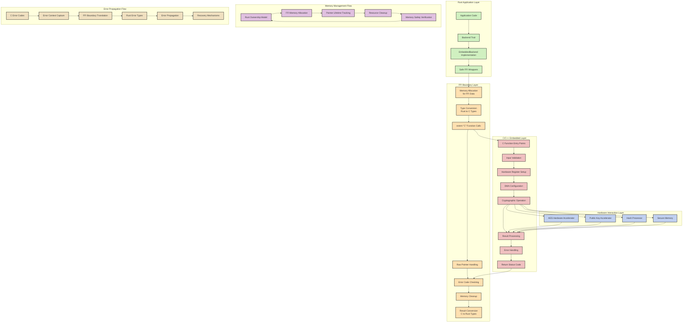

# Rust FFI to Embedded System C/C++ Integration

**Version: 1.0.0**  
**Last Updated: 2025-03-04**

## Overview

This document provides a detailed technical explanation of how CRUSTy leverages Rust's Foreign Function Interface (FFI) to communicate with C/C++ code running on embedded systems. The integration allows us to combine Rust's memory safety with the hardware-specific capabilities of C/C++ embedded systems code, particularly for cryptographic operations on STM32H5 series microcontrollers.

## Technical Architecture

The FFI integration follows a layered architecture that bridges the gap between Rust's safe abstractions and the low-level C/C++ code that interacts directly with hardware:

```
┌─────────────────────────────────────────────────────┐
│                  Rust Application                    │
│                                                     │
│  • Memory-safe application code                     │
│  • Backend trait abstractions                       │
│  • Error handling and propagation                   │
└───────────────────────────┬─────────────────────────┘
                            │
                            ▼
┌─────────────────────────────────────────────────────┐
│                  Rust FFI Layer                      │
│                                                     │
│  • unsafe blocks for FFI calls                      │
│  • Type conversions and marshalling                 │
│  • Memory management (Box, Vec, etc.)               │
│  • Error code translation                           │
└───────────────────────────┬─────────────────────────┘
                            │
                            ▼
┌─────────────────────────────────────────────────────┐
│                  C ABI Boundary                      │
│                                                     │
│  • extern "C" functions                             │
│  • C-compatible data structures                     │
│  • Callback function pointers                       │
│  • Raw pointers                                     │
└───────────────────────────┬─────────────────────────┘
                            │
                            ▼
┌─────────────────────────────────────────────────────┐
│                  C/C++ Implementation                │
│                                                     │
│  • Hardware abstraction layer                       │
│  • Device drivers                                   │
│  • Cryptographic operations                         │
│  • Memory management                                │
└───────────────────────────┬─────────────────────────┘
                            │
                            ▼
┌─────────────────────────────────────────────────────┐
│                  Hardware                            │
│                                                     │
│  • Cryptographic accelerators                       │
│  • Memory protection units                          │
│  • Communication interfaces                         │
│  • Secure elements                                  │
└─────────────────────────────────────────────────────┘
```

## Detailed Technical Flow

The following mermaid diagram illustrates the detailed technical flow of data and control through the Rust-C FFI boundary:



## Rust FFI Implementation Details

### 1. FFI Function Declarations

The Rust side declares external C functions using the `extern "C"` block:

```rust
#[link(name = "crusty_embedded")]
extern "C" {
    // Device management
    fn crusty_device_connect(device_id: *const c_char, connection_type: u8) -> i32;
    fn crusty_device_disconnect(device_handle: i32) -> i32;
    fn crusty_device_status(device_handle: i32) -> i32;
    
    // Cryptographic operations
    fn crusty_encrypt(
        device_handle: i32,
        data: *const u8,
        data_len: usize,
        key: *const u8,
        key_len: usize,
        output: *mut u8,
        output_max_len: usize,
        output_len: *mut usize
    ) -> i32;
    
    fn crusty_decrypt(
        device_handle: i32,
        data: *const u8,
        data_len: usize,
        key: *const u8,
        key_len: usize,
        output: *mut u8,
        output_max_len: usize,
        output_len: *mut usize
    ) -> i32;
    
    // Key derivation
    fn crusty_derive_key(
        device_handle: i32,
        master_key: *const u8,
        master_key_len: usize,
        info: *const u8,
        info_len: usize,
        derived_key: *mut u8,
        derived_key_len: usize
    ) -> i32;
    
    // Error handling
    fn crusty_get_last_error(device_handle: i32, buffer: *mut c_char, buffer_len: usize) -> i32;
}
```

### 2. Safe Wrapper Functions

These raw FFI calls are wrapped in safe Rust functions that handle memory management, error checking, and type conversions:

```rust
impl EmbeddedBackend {
    pub fn connect(&mut self) -> Result<(), EncryptionError> {
        if self.connected {
            return Ok(());
        }
        
        let device_id = CString::new(self.config.device_id.clone())
            .map_err(|_| EncryptionError::Connection("Invalid device ID".to_string()))?;
        
        let connection_type = match self.config.connection_type {
            ConnectionType::Usb => 0,
            ConnectionType::Serial => 1,
            ConnectionType::Ethernet => 2,
        };
        
        let handle = unsafe {
            crusty_device_connect(device_id.as_ptr(), connection_type)
        };
        
        if handle < 0 {
            let mut error_buf = vec![0u8; 256];
            unsafe {
                crusty_get_last_error(handle, error_buf.as_mut_ptr() as *mut c_char, error_buf.len());
            }
            
            let error_message = String::from_utf8_lossy(&error_buf)
                .trim_end_matches('\0')
                .to_string();
                
            return Err(EncryptionError::Connection(error_message));
        }
        
        self.device_handle = handle;
        self.connected = true;
        Ok(())
    }
    
    // Other safe wrapper functions follow a similar pattern...
}
```

### 3. Type Mapping Between Rust and C

The FFI layer requires careful mapping between Rust and C types:

| Rust Type | C Type | Notes |
|-----------|--------|-------|
| `&[u8]` | `const uint8_t*`, `size_t` | Slice becomes pointer + length |
| `&mut [u8]` | `uint8_t*`, `size_t` | Mutable slice becomes mutable pointer + length |
| `String` | `const char*` | Via `CString` for null-termination |
| `Option<T>` | `T*` or `NULL` | `None` becomes `NULL` |
| `Result<T, E>` | Return code + out param | Error codes for failure cases |
| `bool` | `uint8_t` | 0 for false, 1 for true |
| `enum` | `uint8_t`/`uint32_t` | Explicit conversion required |
| `struct` with `#[repr(C)]` | `struct` | Identical memory layout |

### 4. Memory Management Across the FFI Boundary

Memory management is one of the most critical aspects of FFI integration:

```rust
// Example of memory management for encryption operation
fn encrypt_data(&self, data: &[u8], key: &EncryptionKey) -> Result<Vec<u8>, EncryptionError> {
    if !self.connected {
        return Err(EncryptionError::Connection("Not connected to device".to_string()));
    }
    
    // Allocate output buffer with extra space for authentication tag
    let mut output = vec![0u8; data.len() + 16];
    let mut output_len: usize = 0;
    
    // Get raw key bytes
    let key_bytes = key.as_bytes();
    
    let status = unsafe {
        crusty_encrypt(
            self.device_handle,
            data.as_ptr(),
            data.len(),
            key_bytes.as_ptr(),
            key_bytes.len(),
            output.as_mut_ptr(),
            output.len(),
            &mut output_len as *mut usize
        )
    };
    
    if status != 0 {
        // Handle error...
        return Err(EncryptionError::Encryption("Device encryption failed".to_string()));
    }
    
    // Resize output to actual length
    output.truncate(output_len);
    Ok(output)
}
```

Key memory management principles:

1. **Ownership Transfer**: Clear rules for who owns memory on each side of the boundary
2. **Buffer Management**: Pre-allocation of buffers with sufficient size
3. **Lifetime Tracking**: Ensuring pointers remain valid for the duration of FFI calls
4. **Resource Cleanup**: Proper deallocation in both success and error paths
5. **Null Checking**: Validation of pointers before dereferencing

## C/C++ Implementation for STM32H5

### 1. C Header File (Generated by cbindgen)

```c
// crusty_embedded.h
#ifndef CRUSTY_EMBEDDED_H
#define CRUSTY_EMBEDDED_H

#include <stdint.h>
#include <stddef.h>

#ifdef __cplusplus
extern "C" {
#endif

// Device management
int32_t crusty_device_connect(const char* device_id, uint8_t connection_type);
int32_t crusty_device_disconnect(int32_t device_handle);
int32_t crusty_device_status(int32_t device_handle);

// Cryptographic operations
int32_t crusty_encrypt(
    int32_t device_handle,
    const uint8_t* data,
    size_t data_len,
    const uint8_t* key,
    size_t key_len,
    uint8_t* output,
    size_t output_max_len,
    size_t* output_len
);

int32_t crusty_decrypt(
    int32_t device_handle,
    const uint8_t* data,
    size_t data_len,
    const uint8_t* key,
    size_t key_len,
    uint8_t* output,
    size_t output_max_len,
    size_t* output_len
);

// Key derivation
int32_t crusty_derive_key(
    int32_t device_handle,
    const uint8_t* master_key,
    size_t master_key_len,
    const uint8_t* info,
    size_t info_len,
    uint8_t* derived_key,
    size_t derived_key_len
);

// Error handling
int32_t crusty_get_last_error(int32_t device_handle, char* buffer, size_t buffer_len);

#ifdef __cplusplus
}
#endif

#endif // CRUSTY_EMBEDDED_H
```

### 2. C Implementation Example

```c
// crusty_embedded.c
#include "crusty_embedded.h"
#include "stm32h5xx_hal.h"
#include "stm32h5xx_hal_cryp.h"
#include <string.h>

// Device handle structure
typedef struct {
    uint8_t connection_type;
    uint8_t is_connected;
    char device_id[64];
    char last_error[256];
    CRYP_HandleTypeDef hcryp;
    // Other device-specific state...
} DeviceHandle;

// Global array of device handles
#define MAX_DEVICES 4
static DeviceHandle g_devices[MAX_DEVICES];
static uint8_t g_device_count = 0;

// Initialize the device handles
static void init_devices() {
    static uint8_t initialized = 0;
    if (!initialized) {
        memset(g_devices, 0, sizeof(g_devices));
        initialized = 1;
    }
}

// Set last error message
static void set_error(DeviceHandle* device, const char* format, ...) {
    va_list args;
    va_start(args, format);
    vsnprintf(device->last_error, sizeof(device->last_error), format, args);
    va_end(args);
}

// Device management implementation
int32_t crusty_device_connect(const char* device_id, uint8_t connection_type) {
    init_devices();
    
    // Find an available device slot
    int32_t handle = -1;
    for (uint8_t i = 0; i < MAX_DEVICES; i++) {
        if (!g_devices[i].is_connected) {
            handle = i;
            break;
        }
    }
    
    if (handle < 0) {
        return -1; // No available slots
    }
    
    DeviceHandle* device = &g_devices[handle];
    strncpy(device->device_id, device_id, sizeof(device->device_id) - 1);
    device->device_id[sizeof(device->device_id) - 1] = '\0';
    device->connection_type = connection_type;
    
    // Initialize hardware
    if (HAL_CRYP_DeInit(&device->hcryp) != HAL_OK) {
        set_error(device, "Failed to deinitialize cryptographic hardware");
        return -1;
    }
    
    device->hcryp.Instance = CRYP;
    device->hcryp.Init.DataType = CRYP_DATATYPE_8B;
    device->hcryp.Init.KeySize = CRYP_KEYSIZE_256B;
    device->hcryp.Init.Algorithm = CRYP_AES_GCM;
    device->hcryp.Init.pInitVect = NULL; // Will be set for each operation
    device->hcryp.Init.Header = NULL;    // Will be set for each operation
    device->hcryp.Init.HeaderSize = 0;   // Will be set for each operation
    device->hcryp.Init.DataWidthUnit = CRYP_DATAWIDTHUNIT_BYTE;
    
    if (HAL_CRYP_Init(&device->hcryp) != HAL_OK) {
        set_error(device, "Failed to initialize cryptographic hardware");
        return -1;
    }
    
    device->is_connected = 1;
    return handle;
}

// Cryptographic operations implementation
int32_t crusty_encrypt(
    int32_t device_handle,
    const uint8_t* data,
    size_t data_len,
    const uint8_t* key,
    size_t key_len,
    uint8_t* output,
    size_t output_max_len,
    size_t* output_len
) {
    // Validate handle
    if (device_handle < 0 || device_handle >= MAX_DEVICES || !g_devices[device_handle].is_connected) {
        return -1;
    }
    
    DeviceHandle* device = &g_devices[device_handle];
    
    // Validate parameters
    if (!data || !key || !output || !output_len || key_len != 32 || output_max_len < data_len + 16) {
        set_error(device, "Invalid parameters for encryption");
        return -1;
    }
    
    // Generate a random 12-byte nonce
    uint8_t nonce[12];
    if (HAL_RNG_GenerateRandomNumber(&hrng, (uint32_t*)nonce) != HAL_OK ||
        HAL_RNG_GenerateRandomNumber(&hrng, (uint32_t*)(nonce + 4)) != HAL_OK ||
        HAL_RNG_GenerateRandomNumber(&hrng, (uint32_t*)(nonce + 8)) != HAL_OK) {
        set_error(device, "Failed to generate random nonce");
        return -1;
    }
    
    // Copy nonce to the beginning of the output
    memcpy(output, nonce, sizeof(nonce));
    
    // Configure AES-GCM
    device->hcryp.Init.pKey = (uint32_t*)key;
    device->hcryp.Init.pInitVect = (uint32_t*)nonce;
    
    if (HAL_CRYP_Init(&device->hcryp) != HAL_OK) {
        set_error(device, "Failed to initialize cryptographic hardware");
        return -1;
    }
    
    // Perform encryption
    if (HAL_CRYP_AESCCM_Encrypt(&device->hcryp, (uint32_t*)data, data_len, 
                               (uint32_t*)(output + sizeof(nonce)), 10000) != HAL_OK) {
        set_error(device, "Encryption operation failed");
        return -1;
    }
    
    // Set output length (nonce + encrypted data + tag)
    *output_len = sizeof(nonce) + data_len + 16; // 16 bytes for GCM tag
    
    return 0;
}

// Other functions implemented similarly...
```

## Error Handling Across the FFI Boundary

Error handling is a critical aspect of FFI integration, as error models differ between Rust and C:

### 1. C-Side Error Handling

```c
// Error codes
#define CRUSTY_SUCCESS 0
#define CRUSTY_ERROR_INVALID_PARAM -1
#define CRUSTY_ERROR_DEVICE_BUSY -2
#define CRUSTY_ERROR_HARDWARE_FAILURE -3
#define CRUSTY_ERROR_AUTHENTICATION_FAILED -4
#define CRUSTY_ERROR_BUFFER_TOO_SMALL -5
#define CRUSTY_ERROR_INTERNAL -6

// Thread-local error context
static __thread char tls_error_message[256];

// Set detailed error message
void set_error_message(const char* format, ...) {
    va_list args;
    va_start(args, format);
    vsnprintf(tls_error_message, sizeof(tls_error_message), format, args);
    va_end(args);
}

// Function to retrieve error message
int32_t crusty_get_last_error(int32_t device_handle, char* buffer, size_t buffer_len) {
    if (!buffer || buffer_len == 0) {
        return CRUSTY_ERROR_INVALID_PARAM;
    }
    
    if (device_handle >= 0 && device_handle < MAX_DEVICES && g_devices[device_handle].is_connected) {
        strncpy(buffer, g_devices[device_handle].last_error, buffer_len - 1);
    } else {
        strncpy(buffer, tls_error_message, buffer_len - 1);
    }
    
    buffer[buffer_len - 1] = '\0';
    return CRUSTY_SUCCESS;
}
```

### 2. Rust-Side Error Handling

```rust
// Error type for encryption operations
pub enum EncryptionError {
    Connection(String),
    Encryption(String),
    Decryption(String),
    KeyDerivation(String),
    InvalidKey(String),
    InvalidData(String),
    IoError(std::io::Error),
}

impl From<std::io::Error> for EncryptionError {
    fn from(error: std::io::Error) -> Self {
        EncryptionError::IoError(error)
    }
}

// Error handling in FFI wrapper
fn handle_device_error(device_handle: i32) -> EncryptionError {
    let mut error_buf = vec![0u8; 256];
    unsafe {
        crusty_get_last_error(device_handle, error_buf.as_mut_ptr() as *mut c_char, error_buf.len());
    }
    
    let error_message = String::from_utf8_lossy(&error_buf)
        .trim_end_matches('\0')
        .to_string();
        
    match device_handle {
        -1 => EncryptionError::InvalidKey(error_message),
        -2 => EncryptionError::Connection(error_message),
        -3 => EncryptionError::Encryption(error_message),
        -4 => EncryptionError::Decryption(error_message),
        _ => EncryptionError::Connection(format!("Unknown error: {}", error_message)),
    }
}
```

## Security Considerations for FFI Integration

When interfacing between Rust and C/C++, several security risks emerge at the language boundary:

| Risk | Description | Mitigation in CRUSTy |
|------|-------------|----------------------|
| **Memory Safety Violations** | C/C++ lacks Rust's ownership model, potentially leading to use-after-free, double-free, or memory leaks | • Rust wrappers validate all inputs/outputs<br>• Explicit ownership transfer protocols<br>• Minimal unsafe code blocks with clear documentation<br>• Memory isolation through proper buffer management |
| **Undefined Behavior** | Improper type conversions or invalid assumptions can cause undefined behavior | • Comprehensive input validation at boundaries<br>• Using `cbindgen` to generate consistent C headers<br>• Extensive testing of boundary conditions<br>• Static analysis tools for both Rust and C/C++ code |
| **Resource Leaks** | Resources allocated in one language might not be properly released in the other | • RAII patterns with explicit destructors<br>• Resource tracking across boundaries<br>• Cleanup code in both success and error paths<br>• Automatic resource management where possible |
| **Error Propagation** | Different error handling mechanisms between languages can lead to unhandled errors | • Consistent error codes that translate between languages<br>• Error context preservation across boundaries<br>• Fallback mechanisms for catastrophic failures<br>• Comprehensive error logging |
| **Thread Safety** | Different threading models can lead to race conditions or deadlocks | • Thread-safe interface design<br>• Clear documentation of threading requirements<br>• Mutex guards that work across language boundaries<br>• Thread-local storage for error contexts |
| **Side-Channel Attacks** | Cryptographic operations may leak information through timing or power analysis | • Constant-time implementations for cryptographic operations<br>• Hardware-based countermeasures in STM32H5<br>• Isolation of cryptographic operations<br>• Secure key management |
| **Buffer Overflows** | Improper buffer management can lead to memory corruption | • Explicit buffer size checking<br>• Pre-allocation of buffers with sufficient size<br>• Boundary checks before memory operations<br>• Use of Rust's slice types for safe memory access |

## Best Practices for Rust-C FFI in Embedded Systems

1. **Minimize Unsafe Code**: Keep `unsafe` blocks as small as possible, isolating them to just the FFI boundary.

2. **Validate All Inputs**: Check all parameters before passing them to C functions:
   ```rust
   if data.is_empty() || key.as_bytes().len() != 32 {
       return Err(EncryptionError::InvalidData("Invalid input parameters".to_string()));
   }
   ```

3. **Handle All Error Cases**: Ensure every error path is properly handled:
   ```rust
   match status {
       0 => Ok(()),
       -1 => Err(EncryptionError::InvalidKey("Invalid key format".to_string())),
       -2 => Err(EncryptionError::Connection("Device not connected".to_string())),
       _ => Err(handle_device_error(self.device_handle)),
   }
   ```

4. **Use Proper Type Mapping**: Ensure consistent type mapping between Rust and C:
   ```rust
   #[repr(C)]
   struct DeviceConfig {
       connection_type: u8,
       timeout_ms: u32,
       buffer_size: usize,
   }
   ```

5. **Document FFI Boundaries**: Clearly document all FFI functions and their requirements:
   ```rust
   /// Encrypts data using the hardware AES accelerator.
   ///
   /// # Safety
   ///
   /// Caller must ensure:
   /// - `data` points to a valid buffer of at least `data_len` bytes
   /// - `key` points to a valid buffer of exactly 32 bytes
   /// - `output` points to a buffer of at least `data_len + 16` bytes
   /// - `output_len` points to a valid `usize`
   unsafe fn crusty_encrypt(...) -> i32;
   ```

6. **Use Automated Tools**: Leverage tools like `cbindgen` to generate C headers from Rust code:
   ```rust
   // build.rs
   fn main() {
       let crate_dir = std::env::var("CARGO_MANIFEST_DIR").unwrap();
       let config = cbindgen::Config::from_file("cbindgen.toml").unwrap();
       
       cbindgen::Builder::new()
           .with_crate(crate_dir)
           .with_config(config)
           .generate()
           .expect("Unable to generate bindings")
           .write_to_file("include/crusty_embedded.h");
   }
   ```

7. **Test FFI Boundaries**: Create specific tests for the FFI boundary:
   ```rust
   #[test
