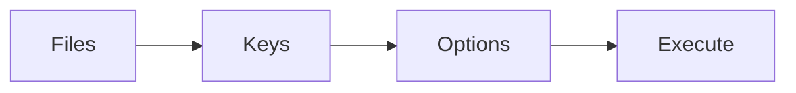
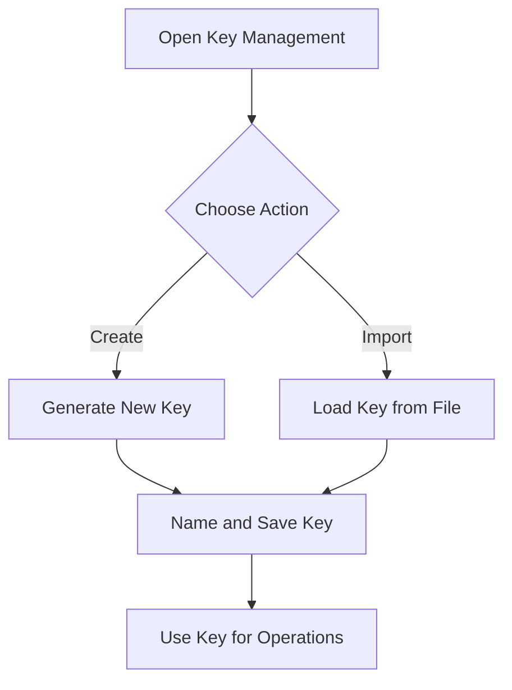
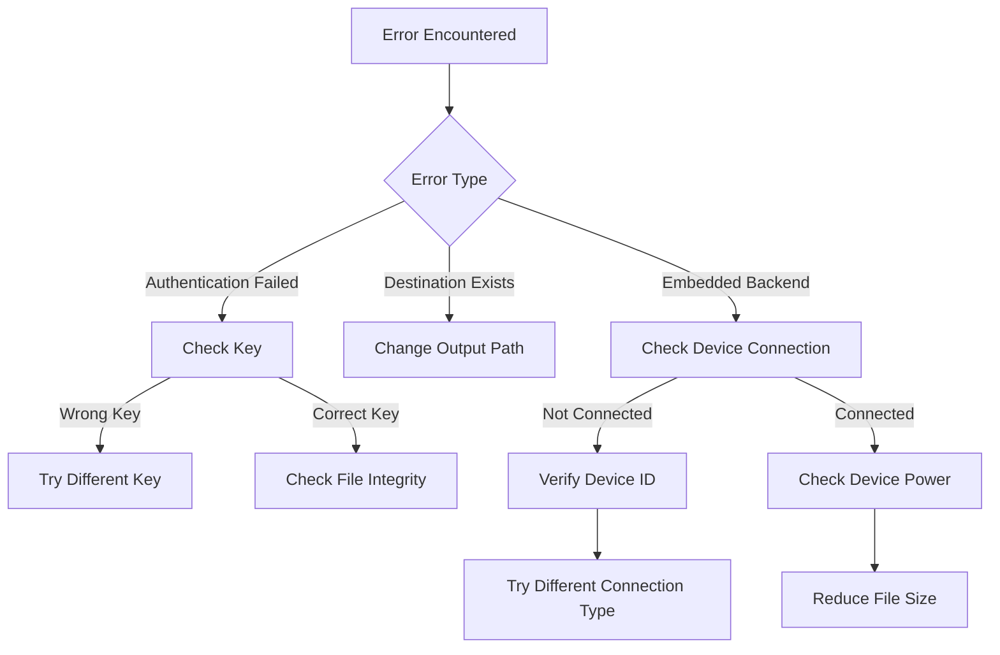

# CRUSTy - Usage Guide

**Version: 1.1.0**  
**Last Updated: 2025-03-04**

## Changelog

### v1.1.0 (2025-03-04)

- Updated documentation to reflect current UI structure
- Clarified embedded system integration status (marked as under development)
- Added information about workflow steps and screens
- Added details about Logs Screen and About Screen
- Updated table of contents to include new sections
- Updated troubleshooting section with additional error cases

### v1.0.0 (2025-03-03)

- Initial documented version
- Added comprehensive usage instructions
- Added embedded system integration usage
- Added workflow and troubleshooting diagrams

This document provides detailed instructions for installing and using the CRUSTy file encryption application.


## Table of Contents

- [Installation](#installation)
  - [Pre-built Binaries](#pre-built-binaries)
  - [Building from Source](#building-from-source)
- [Application Interface](#application-interface)
  - [Dashboard](#dashboard)
  - [Logs Screen](#logs-screen)
  - [About Screen](#about-screen)
  - [Main Screen](#main-screen)
  - [Encryption Workflow](#encryption-workflow)
- [Basic Usage](#basic-usage)
  - [Encrypting Files](#encrypting-files)
  - [Decrypting Files](#decrypting-files)
  - [Managing Keys](#managing-keys)
- [Advanced Features](#advanced-features)
  - [Embedded System Integration](#embedded-system-integration)
  - [Batch Processing](#batch-processing)
- [Troubleshooting](#troubleshooting)

## Installation

### Pre-built Binaries

Download the latest release for your platform from the [Releases](https://github.com/shahern004/CRUSTy/releases) page.

### Building from Source

1. Ensure you have Rust and Cargo installed:

   ```
   curl --proto '=https' --tlsv1.2 -sSf https://sh.rustup.rs | sh
   ```

2. Clone the repository:

   ```
   git clone https://github.com/shahern004/CRUSTy.git
   cd CRUSTy
   ```

3. Build the application:

   ```
   cargo build --release
   ```

4. Run the application:
   ```
   cargo run --release
   ```

## Application Interface

CRUSTy features a tabbed interface with several screens:

### Dashboard

The Dashboard is the starting point of the application, providing quick access to all main functions:

- Encrypt Files
- Decrypt Files
- Key Management
- View Logs
- About

### Logs Screen

The Logs Screen provides access to the application's operation logs:

- View recent encryption and decryption operations
- See detailed information about each operation
- Refresh logs to see the latest entries
- Clear logs when they're no longer needed
- Open the log directory in your file explorer

### About Screen

The About Screen provides information about the application:

- Version information
- Feature list
- Technical details
- License information

### Main Screen

The Main Screen provides access to recent files and secured folders:

- **Recent Files Tab**: Shows recently encrypted or decrypted files
- **Secured Folders Tab**: Shows folders designated for secure operations (coming soon)

The Main Screen also includes:
- Processing mode selection (Single File or Multiple Files)
- Output directory selection
- File selection and display
- Key management options

### Encryption Workflow

The encryption workflow follows a step-by-step process:



1. **Files**: Select the files to encrypt or decrypt and choose an output directory
2. **Keys**: Choose an existing encryption key or create a new one
3. **Options**: Configure encryption settings including backend selection (software or hardware encryption)
4. **Execute**: Review the encryption summary and start the operation

## Basic Usage

**User Workflow**

```mermaid
flowchart TD
    A[Start CRUSTy] --> B{Choose Operation}
    B -->|Encrypt| C[Select File(s)]
    B -->|Decrypt| D[Select Encrypted File(s)]
    C --> E[Select Output Directory]
    D --> F[Select Output Directory]
    E --> G[Select/Create Key]
    F --> H[Select Key]
    G --> L[Click Encrypt]
    H --> M[Click Decrypt]
    L --> N[View Results]
    M --> N
```

### Encrypting Files

1. From the Dashboard, select "Encrypt Files"
2. Choose "Single File" or "Multiple Files" mode
3. Click "Select File(s)" to choose the file(s) you want to encrypt
4. Select an output directory
5. Create a new encryption key or select an existing one
6. Optionally enable hardware encryption (if available)
7. Click "Encrypt"
8. Monitor the progress and view results

### Decrypting Files

1. From the Dashboard, select "Decrypt Files"
2. Choose "Single File" or "Multiple Files" mode
3. Click "Select File(s)" to choose the encrypted file(s)
4. Select an output directory
5. Select the encryption key that was used to encrypt the file(s)
6. Optionally enable hardware encryption (if available)
7. Click "Decrypt"
8. Monitor the progress and view results

### Managing Keys

**Key Management Workflow**



1. Navigate to the "Keys" section by clicking the "🔑 Keys" button
2. Create new keys with custom names
3. Save keys to files for backup
4. Load keys from files


## Advanced Features

### Embedded System Integration

> **Note:** The embedded system integration is currently under development. While the UI elements are present, the backend functionality is not yet fully implemented.

CRUSTy is designed to support offloading cryptographic operations to an STM32H5 embedded device for enhanced performance and security:

1. In the encryption or decryption screen, check the "Use hardware encryption" checkbox
2. Select the appropriate connection type (currently USB or Serial)
3. When fully implemented, this feature will allow:
   - Hardware-accelerated encryption operations
   - Enhanced security through physical isolation
   - Improved performance for large files

For technical details about the embedded system integration, see the [Rust FFI to Embedded System Integration](RUST_FFI_EMBEDDED.md) documentation.

#### Connection Types

- **USB**: For direct connection to the STM32H5 device
- **Serial**: For serial/UART connection to the device

#### Benefits (When Fully Implemented)

- **Performance**: Hardware-accelerated encryption will be faster for large files
- **Security**: Cryptographic operations will be isolated from the main system
- **Power Efficiency**: Will reduce CPU load on your computer


### Batch Processing

For encrypting or decrypting multiple files at once:

1. Select "Multiple Files" mode
2. Click "Select Files" to choose multiple files
3. Select an output directory
4. Select or create an encryption key
5. Click "Encrypt" or "Decrypt"

Progress for each file will be displayed during the operation.

## Troubleshooting

**Troubleshooting Decision Tree**



### Common Issues

**Error: "Destination file already exists"**

- CRUSTy will not overwrite existing files for safety
- Delete the existing file or choose a different output directory

**Error: "Authentication failed: The encryption key is incorrect or the file is corrupted"**

- Make sure you're using the same key that was used to encrypt the file

**Error: "Failed to decrypt: Wrong encryption key used"**

- Try a different encryption key
- If you've lost the key, the file cannot be recovered

**Error: "Embedded backend not implemented"**

- This error occurs when trying to use the embedded backend which is still under development
- The embedded system integration is not yet fully implemented
- Use the standard software encryption instead

**Error: "Failed to connect to embedded device"**

- Verify that the device ID/address is correct
- Check physical connections (USB cable, network connection, etc.)
- Ensure the device is powered on and running the CRUSTy firmware
- Try a different connection type if available

**Error: "Communication error with embedded device"**

- The connection was established but was interrupted during operation
- Check for loose connections
- Ensure the device has stable power
- Try reducing the file size if the operation involves large files

**Error: "No key selected"**

- You must select an encryption key before encrypting or decrypting files
- Go to the Key Management screen to create or select a key

**Error: "No output directory selected"**

- You must select an output directory before encrypting or decrypting files
- Click "Select Output Directory" to choose a directory

### Getting Help

If you encounter issues not covered here, please:

1. Check the [GitHub Issues](https://github.com/shahern004/CRUSTy/issues) for similar problems
2. Open a new issue with details about your problem
3. View the application logs by clicking "Help" > "View Logs" in the menu bar
