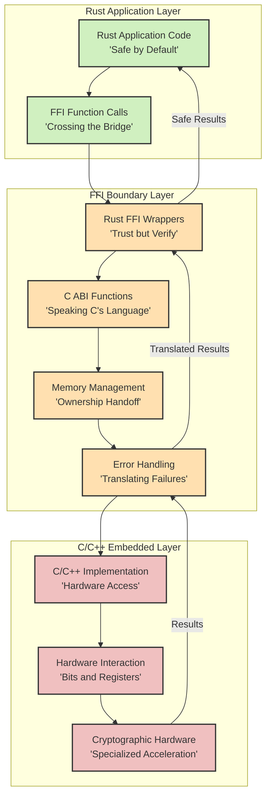

# CRUSTy - A Secure File Encryption Application

CRUSTy is a robust, memory-safe file encryption application built with Rust that implements AES-256-GCM authenticated encryption with a focus on security, usability, and extensibility. It provides a comprehensive solution for protecting sensitive data through strong cryptographic primitives while maintaining a user-friendly interface.

## Quick Start

For detailed installation and usage instructions, please see the [Usage Guide](Documentation/USAGE.md).

## Features

- **Strong Encryption**: Uses AES-256-GCM for secure, authenticated encryption
- **User-Friendly Interface**: Simple and intuitive GUI built with egui
- **Flexible Operation Modes**:
  - Single file encryption/decryption
  - Batch processing for multiple files
- **Key Management**:
  - Generate new encryption keys
  - Save keys to files for later use
  - Load keys from files
  - Manage multiple keys
- **Recipient-Specific Encryption**:
  - Encrypt files for specific recipients using their email address
  - Derive unique encryption keys from recipient emails
  - Automatically detect recipient information during decryption
- **Progress Tracking**: Real-time progress indicators for encryption/decryption operations
- **Operation Logging**: Detailed logs of all encryption and decryption operations
- **Error Handling**: Clear error messages and prevention of corrupted output files

## Security Considerations

- CRUSTy uses AES-256-GCM, a secure authenticated encryption algorithm
- Each file is encrypted with a unique nonce to prevent replay attacks
- Email-based key derivation uses HKDF with SHA-256 for secure key generation
- The application has not been formally audited for security vulnerabilities
- For highly sensitive data, consider using established encryption tools
- I do not advocate using CRUSTy for important usage because it is a learning project

## Rust and C/C++ Interfacing

CRUSTy leverages Rust's Foreign Function Interface (FFI) to communicate with C/C++ code, particularly for the embedded device backend. This architecture allows us to combine Rust's memory safety with the hardware-specific capabilities of C/C++ embedded systems code.

### Behavior Diagram

### Security Risks and Mitigations

When interfacing between Rust and C/C++, several security risks emerge at the language boundary:

| Risk | Description | Mitigation in CRUSTy |
|------|-------------|----------------------|
| **Memory Safety Violations** | C/C++ lacks Rust's ownership model, potentially leading to use-after-free, double-free, or memory leaks | • Rust wrappers validate all inputs/outputs • Explicit ownership transfer protocols • Minimal unsafe code blocks with clear documentation |
| **Undefined Behavior** | Improper type conversions or invalid assumptions can cause undefined behavior | • Comprehensive input validation at boundaries • Using `cbindgen` to generate consistent C headers • Extensive testing of boundary conditions |
| **Resource Leaks** | Resources allocated in one language might not be properly released in the other | • RAII patterns with explicit destructors • Resource tracking across boundaries • Cleanup code in both success and error paths |
| **Error Propagation** | Different error handling mechanisms between languages can lead to unhandled errors | • Consistent error codes that translate between languages • Error context preservation across boundaries • Fallback mechanisms for catastrophic failures |
| **Thread Safety** | Different threading models can lead to race conditions or deadlocks | • Thread-safe interface design • Clear documentation of threading requirements • Mutex guards that work across language boundaries |

Our approach combines Rust's strong safety guarantees with careful boundary design. We use the "trust but verify" principle: while we trust our C/C++ code, we verify all data crossing the language boundary. This creates a secure foundation even when interfacing with potentially unsafe code.

## License

This project is licensed under the MIT License - see the LICENSE file for details.

## Disclaimer

I built CRUSTy for my own learning, but if it can help others that is an amazing benefit. While it uses strong encryption algorithms, it has not been audited for security vulnerabilities. Use at your own risk for sensitive data.
